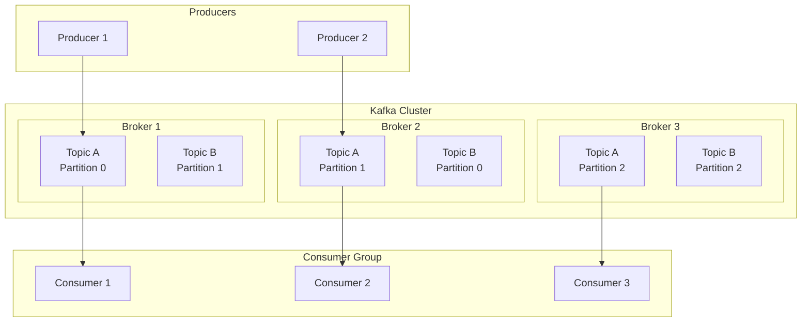
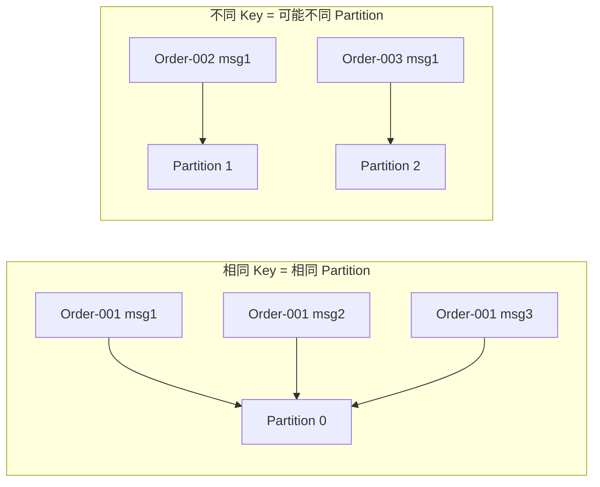

#kafka

# Kafka 基础概念与设计理念

相关笔记：[[kafka-interview]] | [[producer-partition]] | [[producer-compression]] | [[zero-message-loss]] | [[cluster-config]] | [[distributed-transaction]]

## 设计目标

Kafka 的设计目标是成为一个可以帮助大型公司应对各种实时数据流处理的**通用平台**。关键词：**大型公司**、**实时**、**通用**。对应到系统设计上的核心指标：

- **高吞吐量**：处理大量消息
- **低延迟**：消息系统的关键设计指标
- **支持离线数据加载**：支持从离线系统加载数据或将数据导出到离线系统
- **分区式分布式实时处理**：指导了 Topic 分区模型和消费者模型的设计
- **容错与可靠性**：可靠的消息投递和高可用设计

## 发布-订阅模型

发布订阅模型（Pub-Sub）使用 **Topic（主题）** 作为消息通信载体，类似于广播模式。发布者发布一条消息，该消息通过 Topic 传递给所有订阅者。**在消息广播之后才订阅的用户收不到该条消息**。

> 如果只有一个订阅者，发布-订阅模型和队列模型基本等价。因此发布-订阅模型在功能层面可以兼容队列模型。

## 核心架构

![[kafka消费-订阅模型.png]]

## 核心概念

| 概念 | 说明 |
|------|------|
| **Producer（生产者）** | 消息的生产方，负责向 Kafka 发送消息 |
| **Consumer（消费者）** | 消息的消费方，从 Kafka 拉取消息进行处理 |
| **Broker（代理）** | 一个独立的 Kafka 实例，多个 Broker 组成 Kafka Cluster |
| **Topic（主题）** | 消息的逻辑分类，Producer 发到特定 Topic，Consumer 订阅 Topic 消费 |
| **Partition（分区）** | Topic 的物理分片，一个 Topic 可有多个 Partition，分布在不同 Broker 上 |
| **Offset（偏移量）** | 消息在 Partition 中的唯一标识，保证分区内有序 |
| **Consumer Group** | 消费者组，组内每个 Partition 只被一个 Consumer 消费 |
| **Replica（副本）** | Partition 的备份，用于高可用 |

## Kafka 如何保证消息的消费顺序

Kafka 只保证**分区内有序**，不保证跨分区有序。要实现特定消息的顺序消费：

1. **单分区方案**：将 Topic 设为单个 Partition（牺牲吞吐量）
2. **Key 路由方案**：发送时指定相同的 Message Key，同一 Key 的消息会被路由到同一个 Partition

详细的分区策略参见 [[producer-partition]]。
