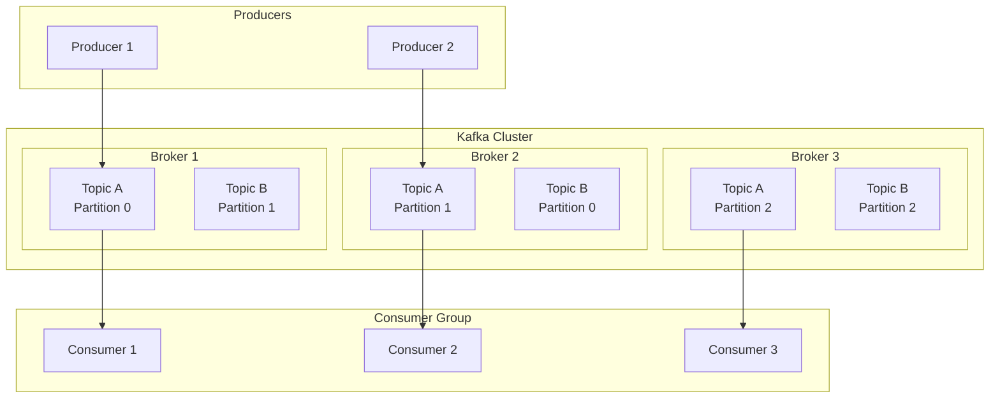
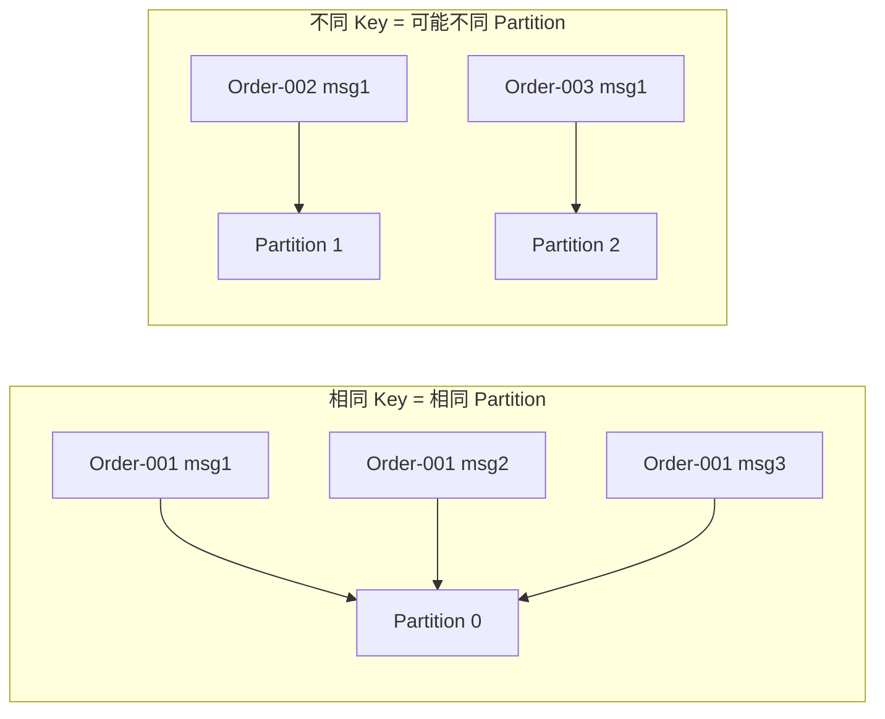

#kafka

# Kafka 基础概念与设计理念

相关笔记：[[kafka-interview]] | [[producer-partition]] | [[producer-compression]] | [[zero-message-loss]] | [[cluster-config]] | [[distributed-transaction]]

## 设计目标

Kafka 的设计目标是成为一个可以帮助大型公司应对各种实时数据流处理的**通用平台**。关键词：**大型公司**、**实时**、**通用**。对应到系统设计上的核心指标：

- **高吞吐量**：处理大量消息
- **低延迟**：消息系统的关键设计指标
- **支持离线数据加载**：支持从离线系统加载数据或将数据导出到离线系统
- **分区式分布式实时处理**：指导了 Topic 分区模型和消费者模型的设计
- **容错与可靠性**：可靠的消息投递和高可用设计

## 发布-订阅模型

发布订阅模型（Pub-Sub）使用 **Topic（主题）** 作为消息通信载体，类似于广播模式。发布者发布一条消息，该消息通过 Topic 传递给所有订阅者。**在消息广播之后才订阅的用户收不到该条消息**。

> 如果只有一个订阅者，发布-订阅模型和队列模型基本等价。因此发布-订阅模型在功能层面可以兼容队列模型。

## 核心架构

![[kafka消费-订阅模型.png]]

## 核心概念

| 概念 | 说明 |
|------|------|
| **Producer（生产者）** | 消息的生产方，负责向 Kafka 发送消息 |
| **Consumer（消费者）** | 消息的消费方，从 Kafka 拉取消息进行处理 |
| **Broker（代理）** | 一个独立的 Kafka 实例，多个 Broker 组成 Kafka Cluster |
| **Topic（主题）** | 消息的逻辑分类，Producer 发到特定 Topic，Consumer 订阅 Topic 消费 |
| **Partition（分区）** | Topic 的物理分片，一个 Topic 可有多个 Partition，分布在不同 Broker 上 |
| **Offset（偏移量）** | 消息在 Partition 中的唯一标识，保证分区内有序 |
| **Consumer Group** | 消费者组，组内每个 Partition 只被一个 Consumer 消费 |
| **Replica（副本）** | Partition 的备份，用于高可用 |

## Kafka 如何保证消息的消费顺序

Kafka 只保证**分区内有序**，不保证跨分区有序。要实现特定消息的顺序消费：

1. **单分区方案**：将 Topic 设为单个 Partition（牺牲吞吐量）
2. **Key 路由方案**：发送时指定相同的 Message Key，同一 Key 的消息会被路由到同一个 Partition

详细的分区策略参见 [[producer-partition]]。

## 面试要点

### 高频问题

**Q: Topic、Partition、Replica 三者是什么关系？**
A: Topic 是消息的逻辑分类，Partition 是 Topic 的物理分片，一个 Topic 可以有多个 Partition 分布在不同 Broker 上以实现水平扩展。每个 Partition 又有多个 Replica（副本）用于高可用，副本分 Leader 和 Follower，默认读写都只走 Leader，Follower 仅从 Leader 同步数据保持冗余（新版本可通过 fetch-from-follower 让 Consumer 就近从 Follower 读，需显式配置）。

**Q: Kafka 如何保证消息的消费顺序？**
A: Kafka 只保证**分区内有序**（按 Offset 单调递增），不保证跨分区有序。要让特定消息有序，可以将 Topic 设为单 Partition（牺牲吞吐量），或者给需要有序的消息指定相同的 Message Key，让它们被路由到同一个 Partition。后者更常用，既保证局部有序又不放弃整体吞吐。

**Q: Consumer Group 的作用是什么？组内消费有什么规则？**
A: Consumer Group 用于实现消费的负载均衡和横向扩展，组内每个 Partition 只能被一个 Consumer 消费（一个 Consumer 可消费多个 Partition），因此一个 Group 内有效 Consumer 数不应超过 Partition 数，多出的 Consumer 会空闲。不同 Consumer Group 之间互不影响、各自维护 Offset，从而同一份消息可被多个业务（Group）独立消费，天然契合发布-订阅模型。

**Q: Offset 是什么？由谁来维护？**
A: Offset 是消息在某个 Partition 内单调递增的唯一标识，用来标记消息位置并跟踪消费进度。消费进度由 Consumer Group 维护，新版本 Kafka 默认提交到内部 Topic `__consumer_offsets`（旧版本存于 ZooKeeper）。Offset 的提交时机决定了投递语义：先提交后处理可能丢消息（at-most-once），先处理后提交可能重复消费（at-least-once）。

**Q: 发布-订阅模型和队列模型有什么区别？Kafka 属于哪种？**
A: 队列模型中一条消息只被一个消费者消费；发布-订阅模型以 Topic 为载体，类似广播，一条消息可被所有订阅者收到，但**广播之后才订阅的消费者收不到历史消息**。Kafka 通过 Consumer Group 同时兼容两者：组内是队列式负载均衡，组间是发布-订阅式广播。

**Q: Partition 越多越好吗？增加 Partition 有什么代价？**
A: 不是。Partition 越多吞吐和并行度越高，但也带来代价：更多的文件句柄和内存开销、Leader 选举/故障恢复时间变长、端到端延迟可能上升，且 Partition 数只能增加不能减少。此外增加 Partition 会改变基于 Key 的哈希路由结果，可能破坏原有的顺序保证，需谨慎规划。

**Q: Kafka 为什么能做到高吞吐？**
A: 核心在于顺序写磁盘（append-only log，避免随机 IO）、利用 OS Page Cache、零拷贝（sendfile，减少内核态与用户态间的数据拷贝）、批量发送与压缩，以及 Partition 带来的水平并行。这些设计共同支撑了 Kafka 高吞吐、低延迟的通用流处理平台目标。

### 面试加分点

- 顺序性更精确的表述：相同 Key 路由到同一 Partition 依赖默认分区器对 Key 做哈希；一旦 Partition 数变化或自定义了分区器，原有顺序可能被打破，生产上常用「业务实体 ID 作 Key」来兜底有序。
- 副本可靠性涉及 ISR（In-Sync Replicas）机制：只有跟得上 Leader 的 Follower 才在 ISR 中，配合 `acks=all` 与 `min.insync.replicas` 才能在不丢消息和可用性之间取得平衡（详见 [[zero-message-loss]]）。
- 能区分 Kafka 与传统 MQ（如 RabbitMQ）：Kafka 是基于日志的 pull 模型，消息消费后不立即删除而是按保留策略（时间/大小）过期，支持消息回溯（重置 Offset 重新消费），更适合大数据流式场景。
- 现代 Kafka（2.8 引入 KRaft 早期预览，3.3 起 KRaft 生产可用，4.0 完全移除 ZooKeeper）用内置 Raft 替代 ZooKeeper 管理元数据，简化了部署并提升了元数据扩展性。
- 理解 rebalance 的代价：Consumer 加入/退出 Group 会触发分区重新分配，传统 eager 模式下消费会全局暂停（Stop-the-World）；可通过 incremental cooperative rebalance（2.4+）、合理设置 `session.timeout.ms`、`max.poll.interval.ms` 及静态成员（static membership）来缓解频繁 rebalance 的影响。
