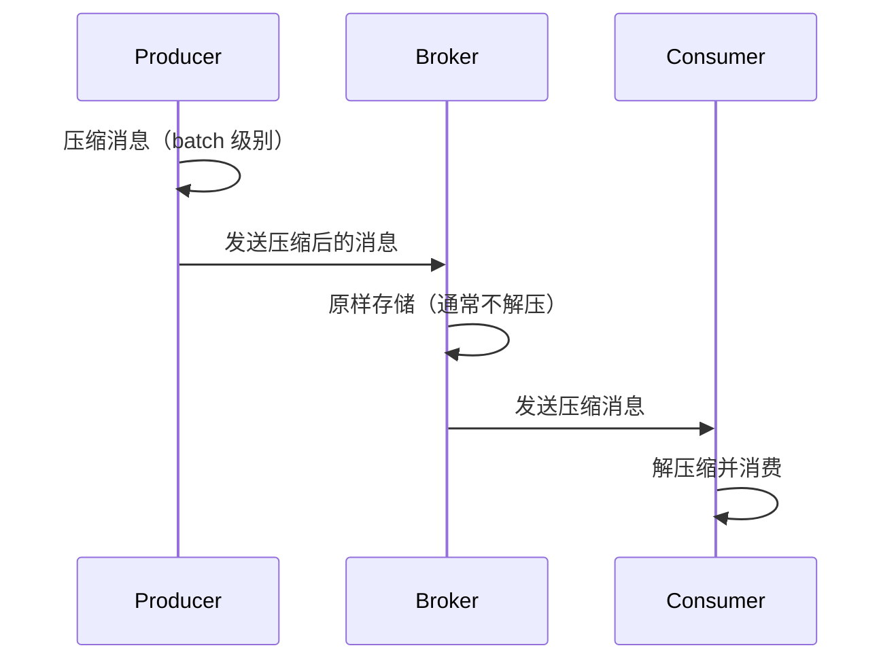
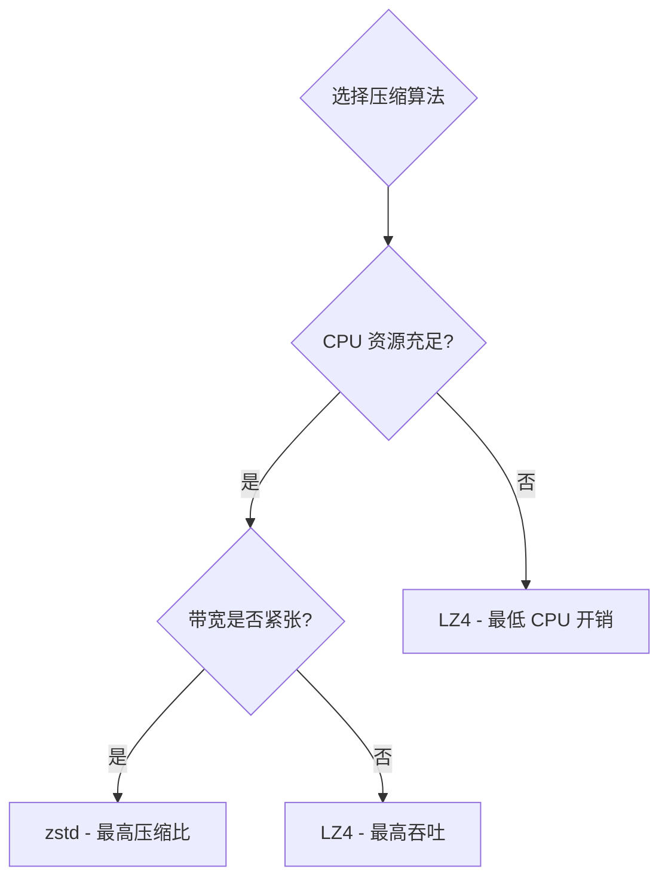

#kafka

# Kafka 消息压缩机制

相关笔记：[[kafka-basics]] | [[producer-partition]] | [[cluster-config]]

## 概述

Kafka 的消息压缩可以在 Producer 端和 Broker 端进行，核心目的是**节省磁盘空间和网络带宽**，提高传输效率。



## Kafka 消息格式演进

Kafka 有两大消息格式版本：

| 特性 | V1 版本 | V2 版本（0.11.0.0+） |
|------|---------|----------------------|
| CRC 校验 | 每条消息独立校验 | 消息集合（RecordBatch）层面校验 |
| 压缩粒度 | 逐条消息压缩 | 整个消息集合压缩 |
| 公共字段 | 每条消息重复存储 | 抽取到外层，减少冗余 |
| 压缩效果 | 较差 | 更优（批量压缩率更高） |

V2 版本的改进显著提升了压缩效果和性能。

## 何时发生压缩

### Producer 端压缩

通过设置 `compression.type` 参数指定压缩算法：

```java
Properties props = new Properties();
props.put("bootstrap.servers", "localhost:9092");
props.put("acks", "all");
props.put("key.serializer", "org.apache.kafka.common.serialization.StringSerializer");
props.put("value.serializer", "org.apache.kafka.common.serialization.StringSerializer");
// 启用 GZIP 压缩
props.put("compression.type", "gzip");

Producer<String, String> producer = new KafkaProducer<>(props);
```

Producer 会将同一个 batch 内的所有消息一起压缩后发送。

### Broker 端压缩

正常情况下 Broker 不会重新压缩消息，但以下两种情况例外：

1. **Broker 端指定了与 Producer 端不同的压缩算法** -- Broker 需要先解压再用新算法重新压缩
2. **消息格式转换** -- 为了兼容老版本 Consumer，Broker 可能需要将 V2 格式转为 V1，导致解压再压缩

> 这两种情况都会显著增加 Broker 端 CPU 开销，应尽量避免。

### Consumer 端解压缩

Consumer 读取消息集合后，根据消息头中的压缩算法标识自动解压缩，对用户透明。

## 压缩算法对比

| 算法 | 压缩比 | 压缩速度 | 解压速度 | CPU 开销 | 适用场景 |
|------|--------|----------|----------|----------|----------|
| **LZ4** | 中等 | 最快 | 最快 | 低 | 高吞吐、低延迟 |
| **Snappy** | 较低 | 快 | 快 | 低 | 通用场景 |
| **zstd** | 最高 | 中等 | 快 | 中等 | 带宽敏感、存储敏感 |
| **GZIP** | 较高 | 慢 | 中等 | 高 | 对压缩比要求高 |

**排序总结**：
- 吞吐量：LZ4 > Snappy > zstd > GZIP
- 压缩比：zstd > LZ4 > GZIP > Snappy

## 最佳实践



1. **Producer 端启用压缩**：CPU 资源充足且带宽有限时，优先选择 zstd
2. **保持格式一致**：避免 Broker 端配置不同的压缩算法，防止不必要的解压/重压缩
3. **避免格式转换**：确保集群内消息格式版本统一，避免 V1/V2 转换开销
4. **高吞吐场景**：优先选择 LZ4，压缩/解压速度最快

## 面试要点

### 高频问题

**Q: Kafka 消息压缩发生在哪一端？Broker 会解压吗？**

> [!question]- 参考答案（点击展开）
>
> 默认在 Producer 端压缩，以 batch（RecordBatch）为单位整批压缩后发送。Broker 正常情况下原样存储不解压，Consumer 拉取后根据 RecordBatch 属性中的压缩算法标识自动解压，整个链路对用户透明。只有当 Broker 配置了与 Producer 不同的 `compression.type`，或为兼容老 Consumer 做消息格式向下转换（down-conversion）时，Broker 才会解压再重压缩。

**Q: 为什么 Kafka V2 消息格式的压缩效果比 V1 好？**

> [!question]- 参考答案（点击展开）
>
> V1 是逐条消息压缩、每条独立做 CRC 校验，公共字段在每条消息里重复存储；V2（0.11.0.0+）以整个消息集合（RecordBatch）为单位压缩，CRC 校验上移到 batch 层面，并把公共字段（如 baseOffset、baseTimestamp）抽取到 batch 外层，单条记录内只存 delta（varint 编码的差值）。批量压缩 + 去冗余使得压缩率和性能都显著提升。

**Q: Kafka 支持哪几种压缩算法，如何选型？**

> [!question]- 参考答案（点击展开）
>
> 支持 GZIP、Snappy、LZ4、zstd 四种（zstd 自 Kafka 2.1.0 起支持）。吞吐排序大致为 LZ4 > Snappy > zstd > GZIP，压缩比排序大致为 zstd > GZIP > LZ4 > Snappy。高吞吐低延迟场景选 LZ4；带宽/存储敏感且 CPU 充足选 zstd 拿最高压缩比；GZIP 压缩比不错但 CPU 开销大、速度慢，通常不推荐新业务使用。

**Q: 哪些情况会触发 Broker 端的解压再压缩？为什么要避免？**

> [!question]- 参考答案（点击展开）
>
> 两种情况：一是 Broker 端 `compression.type` 与 Producer 不同（非默认的 `producer`），Broker 需先解压再用新算法压缩；二是为兼容老版本 Consumer，Broker 把 V2 格式向下转换成 V1（down-conversion），同样会解压重处理。两者都会显著增加 Broker CPU 开销，并且 down-conversion 还会让 Broker 无法走 sendfile 零拷贝，所以应保持算法一致、统一消息格式版本。

**Q: 压缩为什么能提升 Kafka 吞吐量？代价是什么？**

> [!question]- 参考答案（点击展开）
>
> 压缩减小了网络传输和磁盘存储的数据量，单个 batch 携带更多有效消息，相同带宽下吞吐更高，也节省了磁盘空间。代价是 Producer 和 Consumer 端要消耗额外 CPU 做压缩/解压；如果发生 Broker 端重压缩或 down-conversion，还会额外占用 Broker CPU。本质是用 CPU 换网络和磁盘 IO。

**Q: 增大 batch 对压缩有什么影响？**

> [!question]- 参考答案（点击展开）
>
> Kafka 是 batch 级别压缩，batch 越大、同一批内消息越多，重复字段和相似数据越多，压缩率越高、单位数据的压缩开销越低。可以通过调大 `batch.size` 和 `linger.ms` 让 Producer 攒更大的批再压缩发送，从而提升压缩效果和整体吞吐，代价是单条消息的发送延迟略有增加。

**Q: Consumer 端如何知道用什么算法解压？**

> [!question]- 参考答案（点击展开）
>
> 压缩算法标识存储在 RecordBatch 的 attributes 字段中（最低几位编码压缩类型），Consumer 读取消息集合后根据该标识自动选择对应算法解压，无需手动配置。因此同一个 Topic 甚至同一个分区内，不同 batch 可以使用不同的压缩算法共存。

### 面试加分点

- 能区分 V1 的逐条压缩与 V2 的 RecordBatch 整批压缩，并指出 V2 通过 varint/delta 编码把 baseOffset、baseTimestamp 等公共字段外提到 batch 层、单条记录只存差值，是压缩率提升的关键。
- 理解 down-conversion（V2→V1）不仅增加 CPU，还会使 Broker 无法走 sendfile 的零拷贝路径，因此要协调好 `inter.broker.protocol.version`、`log.message.format.version` 与 Consumer 版本，避免触发格式转换。
- 清楚 zstd 在 Kafka 2.1.0+（KIP-110）才被支持，盲目上 zstd 可能导致旧客户端无法消费而不兼容。
- 能从 CPU、带宽、存储三个维度做权衡：CPU 不足选 LZ4，带宽/存储敏感且 CPU 充足选 zstd 拿最高压缩比，并结合 `batch.size`/`linger.ms` 调优让压缩收益最大化。
- 知道压缩默认是端到端透明的（Producer 压、Consumer 解），Broker 默认配 `compression.type=producer` 原样落盘，所以保持 Producer 与 Broker 压缩算法一致是避免性能陷阱的关键运维原则。
