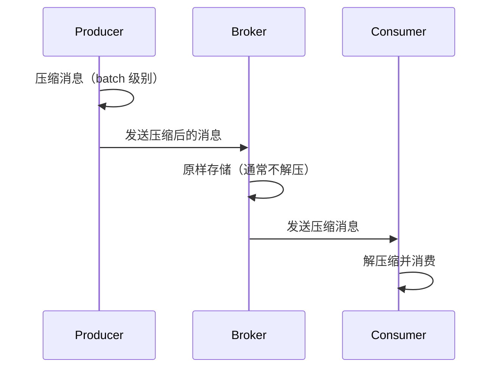
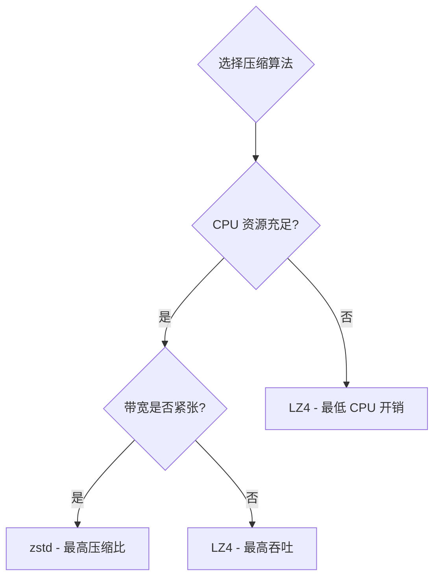

#kafka

# Kafka 消息压缩机制

相关笔记：[[kafka-basics]] | [[producer-partition]] | [[cluster-config]]

## 概述

Kafka 的消息压缩可以在 Producer 端和 Broker 端进行，核心目的是**节省磁盘空间和网络带宽**，提高传输效率。



## Kafka 消息格式演进

Kafka 有两大消息格式版本：

| 特性 | V1 版本 | V2 版本（0.11.0.0+） |
|------|---------|----------------------|
| CRC 校验 | 每条消息独立校验 | 消息集合（RecordBatch）层面校验 |
| 压缩粒度 | 逐条消息压缩 | 整个消息集合压缩 |
| 公共字段 | 每条消息重复存储 | 抽取到外层，减少冗余 |
| 压缩效果 | 较差 | 更优（批量压缩率更高） |

V2 版本的改进显著提升了压缩效果和性能。

## 何时发生压缩

### Producer 端压缩

通过设置 `compression.type` 参数指定压缩算法：

```java
Properties props = new Properties();
props.put("bootstrap.servers", "localhost:9092");
props.put("acks", "all");
props.put("key.serializer", "org.apache.kafka.common.serialization.StringSerializer");
props.put("value.serializer", "org.apache.kafka.common.serialization.StringSerializer");
// 启用 GZIP 压缩
props.put("compression.type", "gzip");

Producer<String, String> producer = new KafkaProducer<>(props);
```

Producer 会将同一个 batch 内的所有消息一起压缩后发送。

### Broker 端压缩

正常情况下 Broker 不会重新压缩消息，但以下两种情况例外：

1. **Broker 端指定了与 Producer 端不同的压缩算法** -- Broker 需要先解压再用新算法重新压缩
2. **消息格式转换** -- 为了兼容老版本 Consumer，Broker 可能需要将 V2 格式转为 V1，导致解压再压缩

> 这两种情况都会显著增加 Broker 端 CPU 开销，应尽量避免。

### Consumer 端解压缩

Consumer 读取消息集合后，根据消息头中的压缩算法标识自动解压缩，对用户透明。

## 压缩算法对比

| 算法 | 压缩比 | 压缩速度 | 解压速度 | CPU 开销 | 适用场景 |
|------|--------|----------|----------|----------|----------|
| **LZ4** | 中等 | 最快 | 最快 | 低 | 高吞吐、低延迟 |
| **Snappy** | 较低 | 快 | 快 | 低 | 通用场景 |
| **zstd** | 最高 | 中等 | 快 | 中等 | 带宽敏感、存储敏感 |
| **GZIP** | 较高 | 慢 | 中等 | 高 | 对压缩比要求高 |

**排序总结**：
- 吞吐量：LZ4 > Snappy > zstd > GZIP
- 压缩比：zstd > LZ4 > GZIP > Snappy

## 最佳实践



1. **Producer 端启用压缩**：CPU 资源充足且带宽有限时，优先选择 zstd
2. **保持格式一致**：避免 Broker 端配置不同的压缩算法，防止不必要的解压/重压缩
3. **避免格式转换**：确保集群内消息格式版本统一，避免 V1/V2 转换开销
4. **高吞吐场景**：优先选择 LZ4，压缩/解压速度最快
