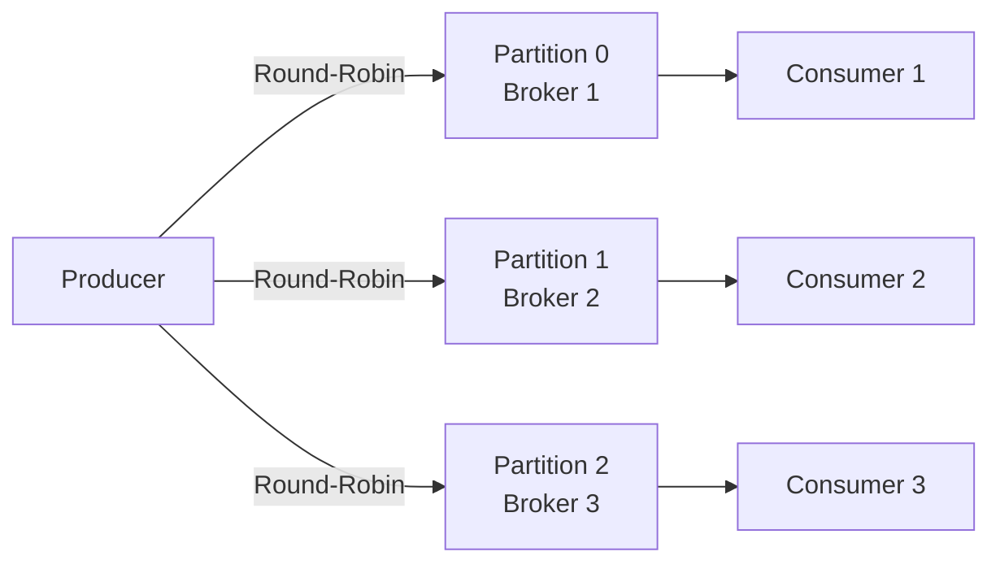
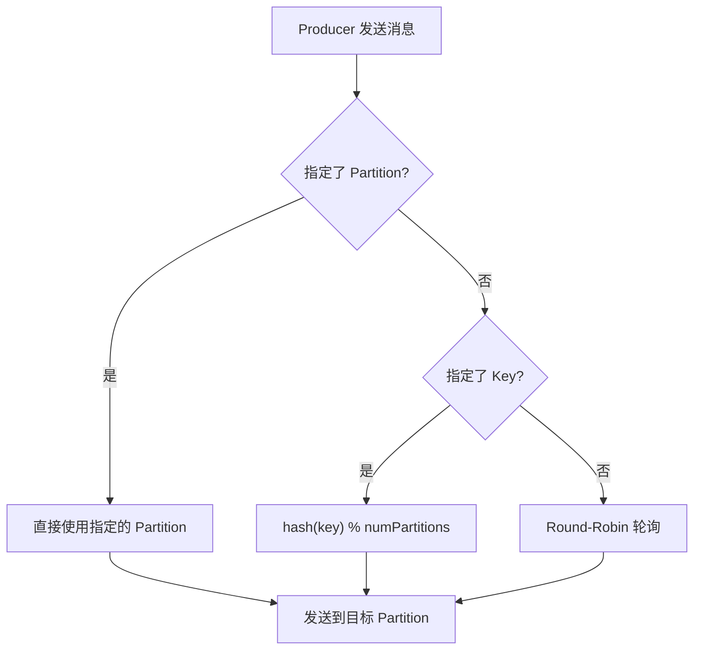

#kafka

# 生产者消息分区机制原理

相关笔记：[[kafka-basics]] | [[kafka-interview]] | [[producer-compression]]

## 为什么需要分区

Kafka 的消息组织方式是三级结构：**Topic -> Partition -> Message**。分区设计的核心目的：

1. **负载均衡**：不同 Partition 分布在不同 Broker 上，读写操作针对 Partition 粒度进行，增加节点即可提升吞吐
2. **水平扩展**：新增 Broker 节点可以承载更多 Partition，系统整体吞吐线性增长
3. **顺序保证**：同一 Partition 内的消息严格有序，可满足业务级别的顺序需求



## 分区策略总览

Kafka 提供了默认分区策略，同时支持自定义。自定义需实现 `org.apache.kafka.clients.producer.Partitioner` 接口。

| 策略 | 适用场景 | 特点 |
|------|----------|------|
| 轮询（Round-Robin） | 通用，无特殊要求 | 消息均匀分布，默认策略 |
| 按 Key 哈希 | 需要相同 Key 的消息有序 | 同 Key 进同 Partition |
| 随机 | 已被轮询取代 | 均匀性不如轮询 |
| 地理位置 | 跨机房部署 | 按 Broker IP 路由 |

### 轮询策略（Round-Robin）

Kafka Java Producer API 的**默认分区策略**。未指定 `partitioner.class` 时，消息按照轮询方式均匀分配到所有 Partition。

> 轮询策略保证了消息最大限度地被平均分配到所有分区，是最常用的分区策略。

### 随机策略（Randomness）

将消息随机放置到任意 Partition。新版本中已被轮询策略取代。

```java
List<PartitionInfo> partitions = cluster.partitionsForTopic(topic);
return ThreadLocalRandom.current().nextInt(partitions.size());
```

### 按消息键保序策略（Key-ordering）

同一个 Key 的所有消息进入相同 Partition，保证分区内有序。

```java
List<PartitionInfo> partitions = cluster.partitionsForTopic(topic);
return Math.abs(key.hashCode()) % partitions.size();
```

**Kafka 默认分区逻辑**：
- 指定了 Key -> 按 Key 哈希取模
- 未指定 Key -> 轮询

### 基于地理位置的分区策略

适用于大规模跨机房的 Kafka 集群。例如北京和广州机房各部署 Broker，按 IP 地址区分南北方用户消息：

```java
List<PartitionInfo> partitions = cluster.partitionsForTopic(topic);
return partitions.stream()
    .filter(p -> isSouth(p.leader().host()))
    .map(PartitionInfo::partition)
    .findAny()
    .get();
```

## 分区策略决策流程



## 实际案例

某国企业务场景中，Kafka 消息具有因果关系，必须保证顺序性。最初将 Topic 设置为单分区，虽然保证了顺序，但丧失了高吞吐和负载均衡优势。

**优化方案**：自定义分区策略，基于消息体中的业务标志位做分区路由。相同业务线的消息进入同一 Partition，既保证了局部有序，又利用了多分区的吞吐优势。本质上是按消息键保序策略的变体。

## 面试要点

### 高频问题

**Q: Kafka 为什么要做分区（Partition）？**

> [!question]- 参考答案（点击展开）
>
> 分区是 Kafka 实现负载均衡、水平扩展和顺序保证的核心。消息组织是 Topic -> Partition -> Message 三级结构，读写以 Partition 为粒度，不同 Partition 可分布在不同 Broker 上，增加 Broker 即可承载更多 Partition、近似线性提升吞吐；同时同一 Partition 内消息严格有序，满足业务级顺序需求。Topic 是逻辑概念，Partition 才是实际存储和并行的最小单元。

**Q: Kafka 生产者默认的分区策略是什么？**

> [!question]- 参考答案（点击展开）
>
> 默认逻辑是：指定了 Key 就按 Key 哈希取模落到固定 Partition；未指定 Key 则在分区间均匀分布。注意两点：1）内置 `DefaultPartitioner` 对 Key 计算哈希用的是 `murmur2(serializedKey)`，并非 `String.hashCode()`，笔记里 `Math.abs(key.hashCode()) % partitions.size()` 是自定义 Partitioner 的示意写法；2）无 Key 时的均匀分配在 Kafka 2.4（KIP-480）之前是逐条 Round-Robin，2.4 起改为 Sticky Partitioning（粘性分区）——先把一批消息粘在同一分区，直到 batch 满或 `linger.ms` 到期再换分区，以减少请求数、增大批次、提升吞吐。

**Q: 如何保证同一类消息的顺序性？**

> [!question]- 参考答案（点击展开）
>
> Kafka 只保证单个 Partition 内有序，跨 Partition 无序。要保证顺序需让相关消息落到同一 Partition——最常用是给相关消息设相同的 Key（按 Key 哈希进同一分区），或自定义 Partitioner 按业务标志位路由。单分区虽能全局有序，但牺牲了吞吐和负载均衡，应尽量用 Key 把顺序粒度收窄到业务维度（如同一订单/用户有序即可）。

**Q: 如何自定义分区策略？**

> [!question]- 参考答案（点击展开）
>
> 实现 `org.apache.kafka.clients.producer.Partitioner` 接口的 `partition()` 方法，在其中基于消息内容（如业务标志位、地理位置）计算目标分区号，可通过 `cluster.partitionsForTopic(topic)` 拿到分区列表。然后在 Producer 配置中通过 `partitioner.class` 指定该实现类。

**Q: 生产者发送消息时分区的选择优先级是怎样的？**

> [!question]- 参考答案（点击展开）
>
> 优先级从高到低为：1）`ProducerRecord` 显式指定了 Partition 号则直接使用；2）未指定 Partition 但指定了 Key，则按 Key 哈希取模；3）两者都未指定，走均匀分配（2.4 前 Round-Robin，2.4 起 Sticky Partitioning）。即 Partition > Key > 默认策略。

**Q: 分区数是不是越多越好？**

> [!question]- 参考答案（点击展开）
>
> 不是。分区越多并行度通常越高，但代价是：每个 Partition 对应一组文件句柄和内存占用，Broker 端打开文件数和副本复制开销增加；Controller 在 Broker 故障时需迁移/重选更多 Partition Leader，导致选举与故障恢复时间变长；端到端延迟也可能上升。需结合目标吞吐、Consumer 数量（分区数决定 Consumer Group 内最大并行度）和集群规模综合评估。

**Q: 按 Key 哈希分区会有什么问题？**

> [!question]- 参考答案（点击展开）
>
> 两类问题。其一，当 Key 分布不均（数据倾斜）时，部分 Partition 成为热点，导致负载不均、个别 Consumer 滞后。其二，一旦分区数变化（如扩容），`hash(key) % numPartitions` 的映射会改变，相同 Key 可能落到新分区，破坏历史顺序保证。因此生产上对依赖 Key 顺序的 Topic 通常一次规划好分区数，避免随意调整，且 Kafka 本身也只支持增加分区、不支持在线减少分区。

### 面试加分点

- 能区分「全局有序」和「分区内有序」：Kafka 只承诺单 Partition 内有序，业务上常用「相同 Key 进同一分区」把全局顺序退化为可接受的局部顺序，兼顾吞吐与顺序。
- 了解 Kafka 2.4（KIP-480）引入的 Sticky Partitioner，以及它如何通过批量粘性写入增大 batch、降低请求数、提升吞吐，缓解小消息逐条轮询导致的 batch 碎片问题；2.4 之前则是逐条 Round-Robin。
- 清楚分区数与 Consumer Group 并行度的关系：一个 Partition 同一时刻只能被 Group 内一个 Consumer 消费，所以 Partition 数是消费并行度的上限，Consumer 多于 Partition 会有空闲实例。
- 理解 `enable.idempotence=true` 配合 `max.in.flight.requests.per.connection`（幂等开启时 <=5 仍可保序，未开启幂等时需设为 1）能在单分区内保证不重复且不乱序；若要真正的 Exactly-Once，还需配置 `transactional.id` 并用事务 API，幂等只是 EOS 的前提之一，不等于 EOS。
- 能结合真实场景设计自定义 Partitioner：如按业务标志位路由让同业务线消息进同一分区，既保证局部有序又利用多分区吞吐，本质是 Key-ordering 策略的变体；或跨机房按 Broker IP 做地理位置路由减少跨机房流量。
