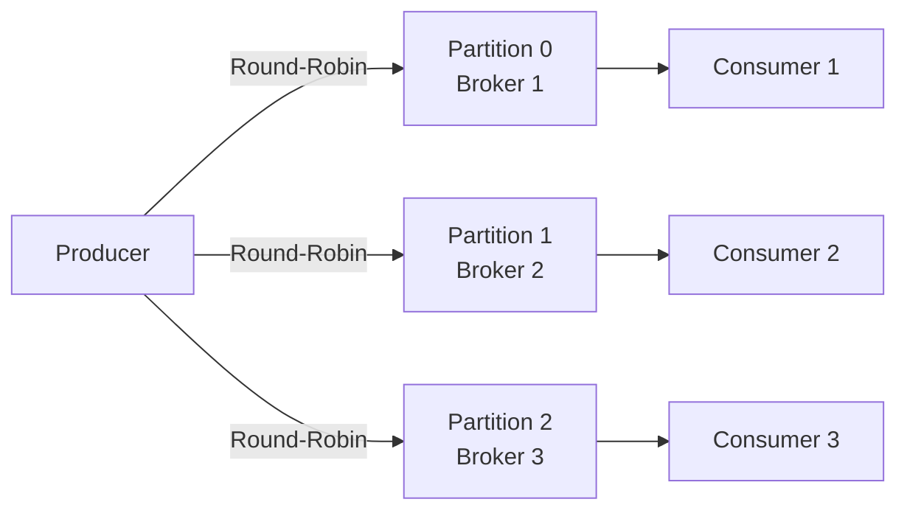
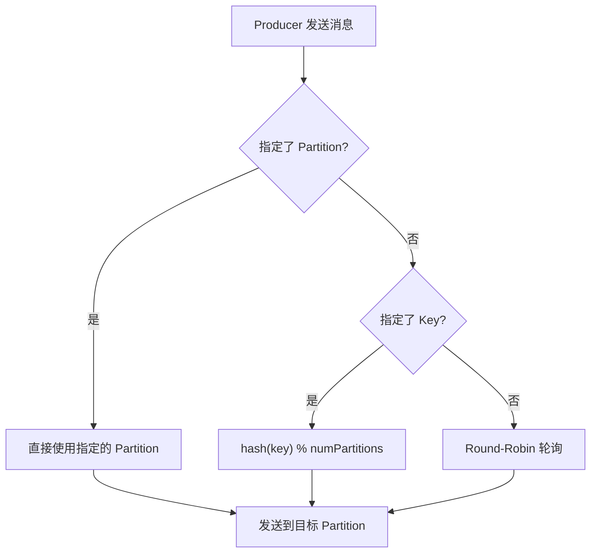

#kafka

# 生产者消息分区机制原理

相关笔记：[[kafka-basics]] | [[kafka-interview]] | [[producer-compression]]

## 为什么需要分区

Kafka 的消息组织方式是三级结构：**Topic -> Partition -> Message**。分区设计的核心目的：

1. **负载均衡**：不同 Partition 分布在不同 Broker 上，读写操作针对 Partition 粒度进行，增加节点即可提升吞吐
2. **水平扩展**：新增 Broker 节点可以承载更多 Partition，系统整体吞吐线性增长
3. **顺序保证**：同一 Partition 内的消息严格有序，可满足业务级别的顺序需求



## 分区策略总览

Kafka 提供了默认分区策略，同时支持自定义。自定义需实现 `org.apache.kafka.clients.producer.Partitioner` 接口。

| 策略 | 适用场景 | 特点 |
|------|----------|------|
| 轮询（Round-Robin） | 通用，无特殊要求 | 消息均匀分布，默认策略 |
| 按 Key 哈希 | 需要相同 Key 的消息有序 | 同 Key 进同 Partition |
| 随机 | 已被轮询取代 | 均匀性不如轮询 |
| 地理位置 | 跨机房部署 | 按 Broker IP 路由 |

### 轮询策略（Round-Robin）

Kafka Java Producer API 的**默认分区策略**。未指定 `partitioner.class` 时，消息按照轮询方式均匀分配到所有 Partition。

> 轮询策略保证了消息最大限度地被平均分配到所有分区，是最常用的分区策略。

### 随机策略（Randomness）

将消息随机放置到任意 Partition。新版本中已被轮询策略取代。

```java
List<PartitionInfo> partitions = cluster.partitionsForTopic(topic);
return ThreadLocalRandom.current().nextInt(partitions.size());
```

### 按消息键保序策略（Key-ordering）

同一个 Key 的所有消息进入相同 Partition，保证分区内有序。

```java
List<PartitionInfo> partitions = cluster.partitionsForTopic(topic);
return Math.abs(key.hashCode()) % partitions.size();
```

**Kafka 默认分区逻辑**：
- 指定了 Key -> 按 Key 哈希取模
- 未指定 Key -> 轮询

### 基于地理位置的分区策略

适用于大规模跨机房的 Kafka 集群。例如北京和广州机房各部署 Broker，按 IP 地址区分南北方用户消息：

```java
List<PartitionInfo> partitions = cluster.partitionsForTopic(topic);
return partitions.stream()
    .filter(p -> isSouth(p.leader().host()))
    .map(PartitionInfo::partition)
    .findAny()
    .get();
```

## 分区策略决策流程



## 实际案例

某国企业务场景中，Kafka 消息具有因果关系，必须保证顺序性。最初将 Topic 设置为单分区，虽然保证了顺序，但丧失了高吞吐和负载均衡优势。

**优化方案**：自定义分区策略，基于消息体中的业务标志位做分区路由。相同业务线的消息进入同一 Partition，既保证了局部有序，又利用了多分区的吞吐优势。本质上是按消息键保序策略的变体。
