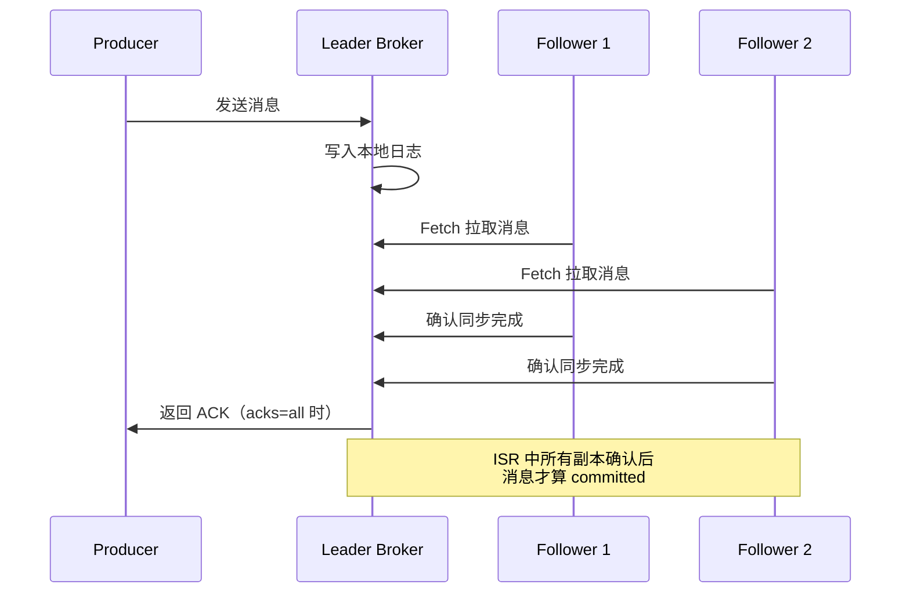
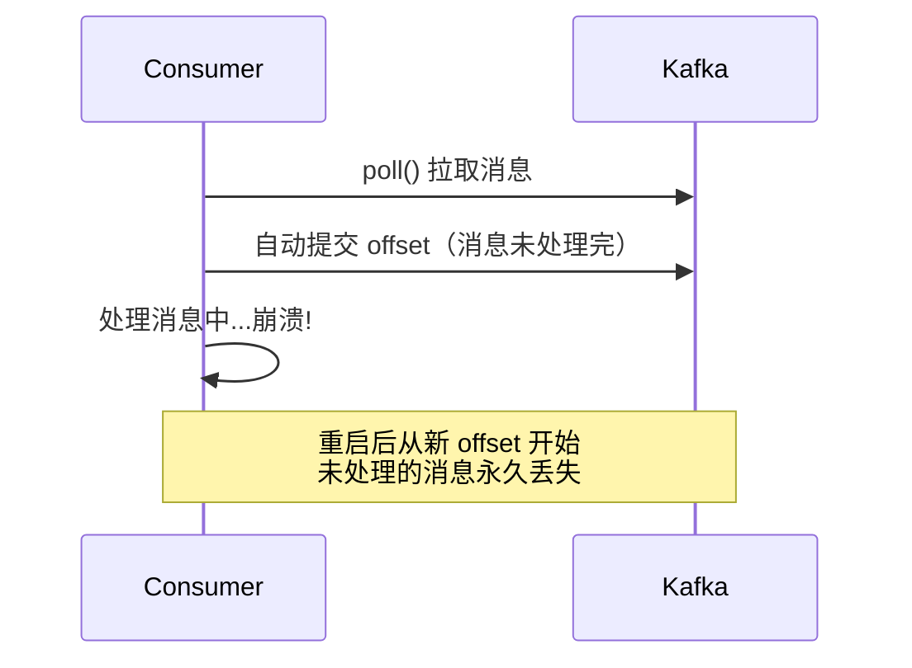
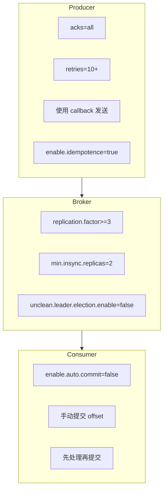

#kafka

# Kafka 消息零丢失保证

相关笔记：[[kafka-basics]] | [[kafka-interview]] | [[cluster-config]]

## Kafka 的持久化承诺

Kafka 只对**已提交（committed）的消息**提供有限度的持久化保证。这包含两层含义：

1. **已提交的消息**：若干个 Broker 成功接收并写入日志后，才算 committed。具体由多少个 Broker 确认取决于 `acks` 配置。
2. **有限度的保证**：至少一个保存了该消息的 Broker 存活，Kafka 就能保证消息不丢失。



## 常见消息丢失场景

### 场景一：Producer 端丢失

**原因**：使用 `producer.send(msg)` 异步发送后不管结果，网络异常或 Broker 故障时消息静默丢失。

**解决方案**：使用带回调的发送 API：

```java
producer.send(msg, (metadata, exception) -> {
    if (exception != null) {
        // 记录日志、重试或报警
        log.error("消息发送失败: {}", exception.getMessage());
    } else {
        log.info("消息发送成功: topic={}, partition={}, offset={}",
            metadata.topic(), metadata.partition(), metadata.offset());
    }
});
```

### 场景二：Consumer 端丢失

**原因**：自动提交 offset 后消息还未处理完，Consumer 崩溃导致消息丢失。



**解决方案**：关闭自动提交，手动控制 offset：

```java
// 关闭自动提交
props.put("enable.auto.commit", "false");

while (true) {
    ConsumerRecords<String, String> records = consumer.poll(Duration.ofMillis(100));
    for (ConsumerRecord<String, String> record : records) {
        // 先处理消息
        processMessage(record);
    }
    // 处理完成后再手动提交
    consumer.commitSync();
}
```

### 场景三：多线程消费丢失

**原因**：多线程异步处理消息时，主线程自动提交了 offset，但某个工作线程处理失败。

**解决方案**：
- 关闭自动提交 offset
- 等所有工作线程处理完成后再手动提交
- 必要时记录每条消息的处理状态

## 零丢失最佳实践配置

### 三端配置一览



### Producer 配置

| 参数 | 值 | 说明 |
|------|-----|------|
| `acks` | `all` | 所有 ISR 副本确认才算成功 |
| `retries` | 较大值 | 瞬时错误自动重试 |
| `enable.idempotence` | `true` | 开启幂等性，防止重复消息 |

### Broker 配置

| 参数 | 值 | 说明 |
|------|-----|------|
| `unclean.leader.election.enable` | `false` | 禁止落后副本当选 Leader |
| `replication.factor` | `>=3` | 至少 3 个副本 |
| `min.insync.replicas` | `>1` | 至少 2 个副本写入才算 committed |

> 注意：必须保证 `replication.factor > min.insync.replicas`，否则单个副本挂掉就会导致分区不可写。

### Consumer 配置

| 参数 | 值 | 说明 |
|------|-----|------|
| `enable.auto.commit` | `false` | 关闭自动提交 |
| 提交时机 | 处理完成后 | 先消费再手动 commitSync |

## 小结

1. 理解 Kafka 持久化保证的**含义和限定条件** -- 只保证 committed 消息在至少一个 Broker 存活时不丢失
2. Producer 端**永远使用带回调的发送 API**，处理发送失败
3. Broker 端**多副本 + ISR 机制**是数据可靠性的基石
4. Consumer 端**关闭自动提交**，手动控制 offset 提交时机

## 面试要点

### 高频问题

**Q: Kafka 如何保证消息不丢失？**

> [!question]- 参考答案（点击展开）
>
> 需要 Producer、Broker、Consumer 三端协同配置，缺一不可。Producer 端用 `acks=all` 并带 callback 发送、开启 `enable.idempotence`；Broker 端 `replication.factor>=3`、`min.insync.replicas>=2`、关闭 `unclean.leader.election`；Consumer 端关闭自动提交、先处理再手动 commit。注意 Kafka 只对**已提交（committed）消息**在「至少一个保存该消息的 Broker 存活」时提供持久化保证。

**Q: `acks` 三种取值的区别是什么？**

> [!question]- 参考答案（点击展开）
>
> `acks=0` 不等任何确认，吞吐最高但最易丢；`acks=1` 只等 Leader 写入本地日志，Leader 宕机且未同步给 Follower 时会丢；`acks=all`（即 `-1`）等 ISR 中所有副本确认，配合 `min.insync.replicas` 才有真正的持久化保证。注意默认值与版本相关：Kafka 3.0 之前 Producer 默认 `acks=1`，3.0+ 因 `enable.idempotence` 默认开启，`acks` 默认变为 `all`。

**Q: 为什么只配 `acks=all` 还不够，必须配 `min.insync.replicas`？**

> [!question]- 参考答案（点击展开）
>
> `acks=all` 只要求 ISR 中所有副本确认，但若 ISR 因 Follower 掉队收缩到只剩 Leader 一个，`acks=all` 就退化成 `acks=1`。`min.insync.replicas=2` 强制 ISR 至少有 2 个副本在线才接受写入，否则 Producer 收到 `NotEnoughReplicasException`，从而堵住单副本写入的丢失漏洞。

**Q: 为什么要求 `replication.factor > min.insync.replicas`？**

> [!question]- 参考答案（点击展开）
>
> 若两者相等（如都为 3），那么只要挂掉一个副本，存活副本数就低于 `min.insync.replicas`，分区立即不可写，可用性骤降。常见组合是 `replication.factor=3` + `min.insync.replicas=2`，允许容忍 1 个副本故障仍可读写，在可靠性和可用性间取得平衡。

**Q: Consumer 端消息丢失的根因是什么，怎么解决？**

> [!question]- 参考答案（点击展开）
>
> 根因是自动提交 offset（`enable.auto.commit=true`）会按 `auto.commit.interval.ms` 周期性提交，可能在消息还没处理完时就提交了，Consumer 崩溃后从新 offset 拉取，未处理消息永久丢失。解决方案是关闭自动提交，遵循「先处理消息、再手动 commitSync/commitAsync」的顺序。

**Q: 手动提交 offset 会不会导致重复消费？如何保证 Exactly-Once？**

> [!question]- 参考答案（点击展开）
>
> 会。先处理后提交意味着处理完但 commit 前崩溃，重启会重复消费，这是 At-Least-Once 语义。要做到端到端 Exactly-Once，需要 Consumer 侧业务幂等（如唯一键去重），或使用 Kafka Transactions（`read-process-write` 配合 `isolation.level=read_committed`）将消费与下游写入放在同一事务中。

**Q: `enable.idempotence=true` 解决了什么问题，原理是什么？**

> [!question]- 参考答案（点击展开）
>
> 解决 Producer 因重试导致的单分区消息重复。Broker 为每个 Producer 分配 PID（Producer ID），每条消息带单调递增的 sequence number，Broker 按 `<PID, partition, seq>` 去重，保证单分区单会话内消息不重不乱序。开启幂等要求 `acks=all`、`retries>0` 且 `max.in.flight.requests.per.connection<=5`（Kafka 会校验，不满足则启动报错）。Kafka 3.0+ 该项默认即为 `true`。

### 面试加分点

- 区分 ISR（In-Sync Replicas）与 OSR：只有 ISR 中的副本才有资格参与 `acks=all` 确认；`unclean.leader.election.enable=false` 时也只有 ISR 副本能当选 Leader。Follower 落后超过 `replica.lag.time.max.ms` 会被踢出 ISR，避免慢副本阻塞写入。
- 解释 `unclean.leader.election.enable=false` 的代价：禁止落后副本（非 ISR）当选 Leader 可避免数据回退丢失，但当所有 ISR 副本都挂掉时分区会不可用，这是用可用性换一致性的取舍（该项自 0.11 起默认即为 `false`）。
- HW（High Watermark）与 LEO（Log End Offset）机制：Consumer 只能读到 HW 之前的消息，HW 取 ISR 中最小的 LEO，这保证了消费者读不到未被所有 ISR 副本确认的数据，是「已提交」语义的底层实现。
- Producer 重试可能导致乱序：未开启幂等时若 `max.in.flight.requests.per.connection>1`，重试会打乱分区内消息顺序，需设为 1 才能保序；开启幂等后 Kafka 借助 sequence number 在该值 `<=5` 时仍能保序。
- 多线程消费的陷阱：主线程 poll 后分发给工作线程异步处理，若主线程按批提交 offset 而某工作线程失败，会造成「提交了但没处理成功」的丢失，需为每条消息单独跟踪处理状态后再提交对应 offset。
