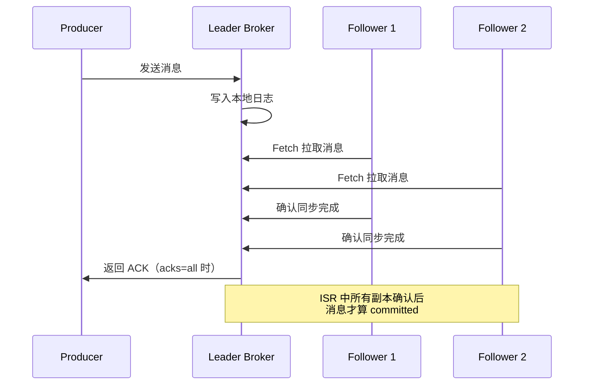
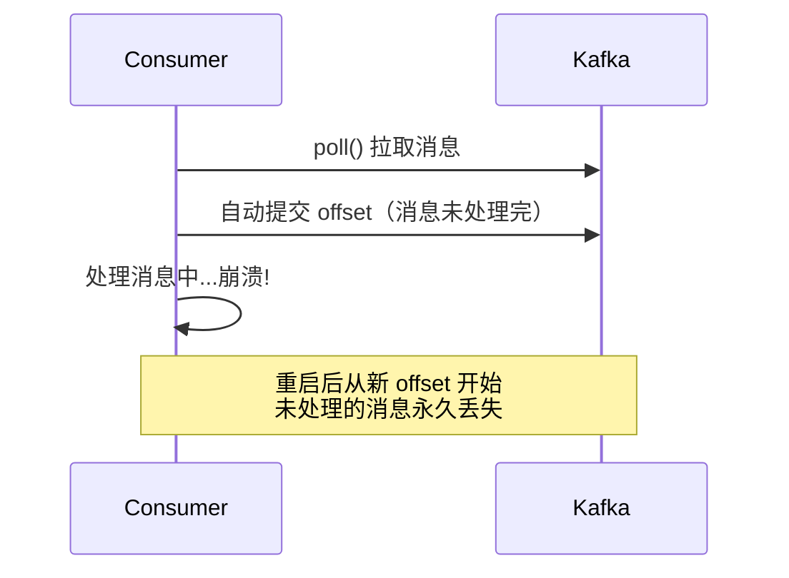
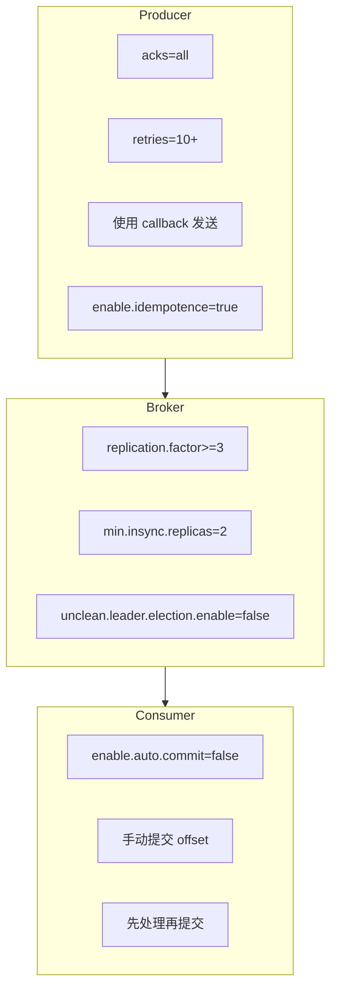

#kafka

# Kafka 消息零丢失保证

相关笔记：[[kafka-basics]] | [[kafka-interview]] | [[cluster-config]]

## Kafka 的持久化承诺

Kafka 只对**已提交（committed）的消息**提供有限度的持久化保证。这包含两层含义：

1. **已提交的消息**：若干个 Broker 成功接收并写入日志后，才算 committed。具体由多少个 Broker 确认取决于 `acks` 配置。
2. **有限度的保证**：至少一个保存了该消息的 Broker 存活，Kafka 就能保证消息不丢失。



## 常见消息丢失场景

### 场景一：Producer 端丢失

**原因**：使用 `producer.send(msg)` 异步发送后不管结果，网络异常或 Broker 故障时消息静默丢失。

**解决方案**：使用带回调的发送 API：

```java
producer.send(msg, (metadata, exception) -> {
    if (exception != null) {
        // 记录日志、重试或报警
        log.error("消息发送失败: {}", exception.getMessage());
    } else {
        log.info("消息发送成功: topic={}, partition={}, offset={}",
            metadata.topic(), metadata.partition(), metadata.offset());
    }
});
```

### 场景二：Consumer 端丢失

**原因**：自动提交 offset 后消息还未处理完，Consumer 崩溃导致消息丢失。



**解决方案**：关闭自动提交，手动控制 offset：

```java
// 关闭自动提交
props.put("enable.auto.commit", "false");

while (true) {
    ConsumerRecords<String, String> records = consumer.poll(Duration.ofMillis(100));
    for (ConsumerRecord<String, String> record : records) {
        // 先处理消息
        processMessage(record);
    }
    // 处理完成后再手动提交
    consumer.commitSync();
}
```

### 场景三：多线程消费丢失

**原因**：多线程异步处理消息时，主线程自动提交了 offset，但某个工作线程处理失败。

**解决方案**：
- 关闭自动提交 offset
- 等所有工作线程处理完成后再手动提交
- 必要时记录每条消息的处理状态

## 零丢失最佳实践配置

### 三端配置一览



### Producer 配置

| 参数 | 值 | 说明 |
|------|-----|------|
| `acks` | `all` | 所有 ISR 副本确认才算成功 |
| `retries` | 较大值 | 瞬时错误自动重试 |
| `enable.idempotence` | `true` | 开启幂等性，防止重复消息 |

### Broker 配置

| 参数 | 值 | 说明 |
|------|-----|------|
| `unclean.leader.election.enable` | `false` | 禁止落后副本当选 Leader |
| `replication.factor` | `>=3` | 至少 3 个副本 |
| `min.insync.replicas` | `>1` | 至少 2 个副本写入才算 committed |

> 注意：必须保证 `replication.factor > min.insync.replicas`，否则单个副本挂掉就会导致分区不可写。

### Consumer 配置

| 参数 | 值 | 说明 |
|------|-----|------|
| `enable.auto.commit` | `false` | 关闭自动提交 |
| 提交时机 | 处理完成后 | 先消费再手动 commitSync |

## 小结

1. 理解 Kafka 持久化保证的**含义和限定条件** -- 只保证 committed 消息在至少一个 Broker 存活时不丢失
2. Producer 端**永远使用带回调的发送 API**，处理发送失败
3. Broker 端**多副本 + ISR 机制**是数据可靠性的基石
4. Consumer 端**关闭自动提交**，手动控制 offset 提交时机
