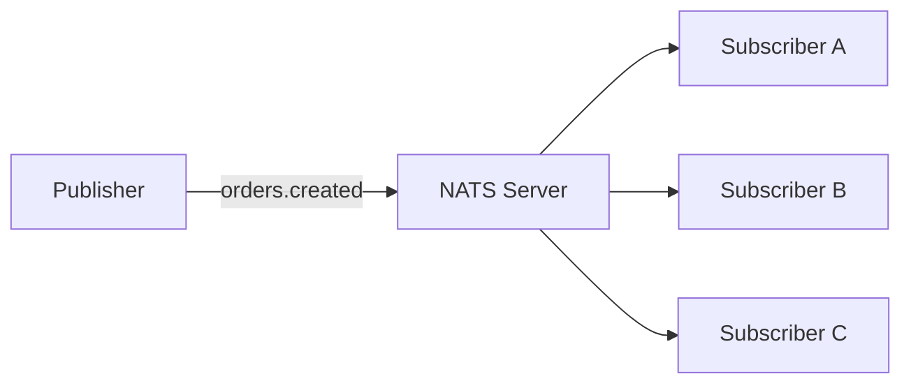
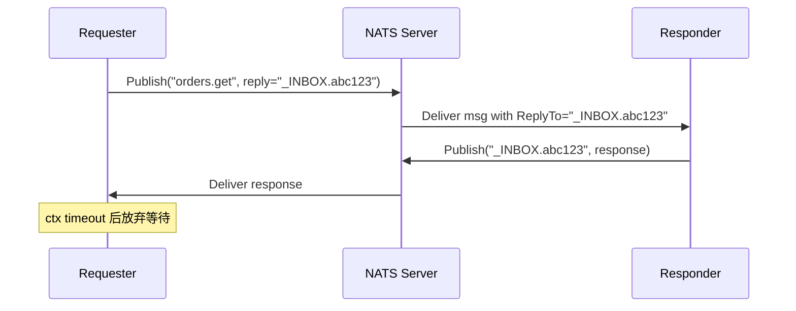
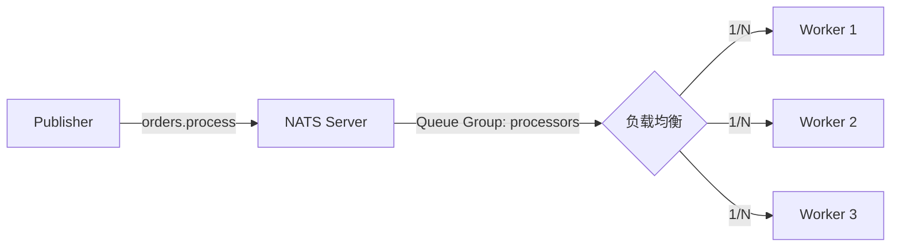
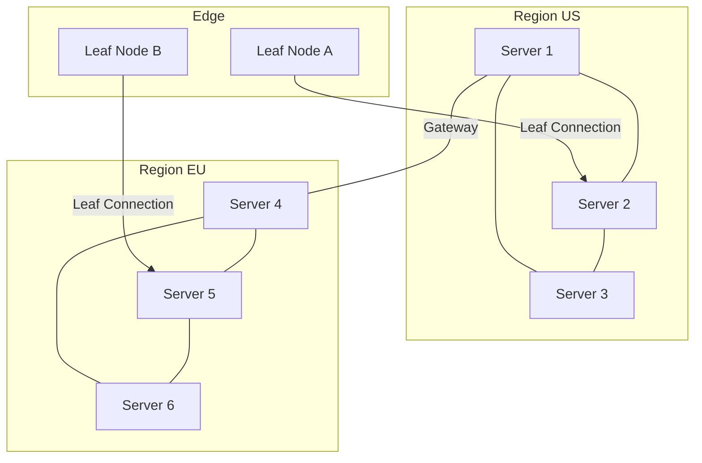

#nats #messaging #middleware

相关笔记：[[kafka-basics]] | [[nats-jetstream]] | [[distributed-transaction]]

# NATS 基础与核心概念

## NATS 是什么

NATS 是一个开源的、云原生的消息系统，由 Synadia 维护，使用 Go 编写。它的设计哲学是 **简单、高性能、轻量**。

### 与 Kafka 的定位对比

| 维度 | NATS | Kafka |
|------|------|-------|
| 定位 | 轻量级消息总线 / 服务通信 | 高吞吐持久化事件流平台 |
| 延迟 | 微秒级（~10µs） | 毫秒级（~5-10ms） |
| 持久化 | 可选（JetStream） | 默认持久化 |
| 部署复杂度 | 极低，单二进制 | 高（ZooKeeper/KRaft + Broker） |
| 消息回溯 | JetStream 支持 | 原生支持 |
| 适用场景 | 微服务通信、IoT、实时控制 | 日志收集、事件溯源、大数据 |

NATS 核心模式（Core NATS）是 **at-most-once**，不持久化；JetStream 扩展层提供持久化能力。

---

## 核心概念

### Subject（主题）

Subject 是 NATS 中消息路由的基础，使用点分层结构：

```
orders.created
orders.us.created
orders.*.created    # * 匹配单层通配符
orders.>            # > 匹配多层通配符（必须在末尾）
```

- `*` 匹配单个 token：`orders.*.created` 匹配 `orders.us.created` 但不匹配 `orders.us.east.created`
- `>` 匹配剩余所有：`orders.>` 匹配 `orders.us.created`、`orders.us.east.created` 等

### Publisher（发布者）

发布者向指定 Subject 发送消息，无需关心有多少订阅者在监听。消息是 fire-and-forget 模式（Core NATS）。

### Subscriber（订阅者）

订阅者订阅 Subject，接收匹配的消息。可以使用通配符订阅多个 Subject。

### Queue Group（队列组）

Queue Group 实现服务端的负载均衡：多个订阅者加入同一个 Queue Group，NATS Server 只会将消息投递给组内**一个**订阅者（随机选择）。

```
# 三个实例都订阅 orders.created，加入 queue group "order-processors"
# 每条消息只有一个实例处理 —— 水平扩展的关键机制
```

---

## 消息模式

### 1. Publish-Subscribe（发布-订阅）

经典的一对多广播模式，每个订阅者都会收到消息。



### 2. Request-Reply（请求-回复）

同步请求-响应模式，NATS 自动生成一个唯一的 reply subject：



### 3. Queue Subscribe（队列订阅）

负载均衡模式，多实例竞争消费，适合横向扩展服务：



---

## NATS 架构

### 单 Server

最简配置，单进程，内存路由，适合开发和测试。

### Cluster（集群）

多个 NATS Server 组成集群，客户端连接任意一个 Server，消息在集群内自动路由。

- 每个 Server 与其他所有 Server 建立 full-mesh 路由连接
- 推荐奇数个节点（3、5、7），避免脑裂

### Leaf Node

Leaf Node 是一种轻量级的 NATS Server，连接到远端集群或 Synadia Cloud：

- 适合边缘设备、IoT 网关、私有数据中心延伸
- 流量按需发送，减少带宽占用

### Gateway（SuperCluster）

Gateway 连接多个独立的 NATS Cluster，形成 SuperCluster：

- 不同地理区域的集群通过 Gateway 互联
- Interest-based routing：只有当目标集群有订阅者时，消息才会转发



---

## 连接与认证

### TLS

所有连接（客户端到 Server、Server 到 Server）均可使用 TLS 加密。

### NKey（Ed25519 密钥对）

基于 Ed25519 公钥密码学，Server 只需持有公钥，私钥不离开客户端：

```
# 生成 User NKey
nsc add user --name myuser
```

### JWT 认证

结合 NKey 使用，Operator > Account > User 三层 JWT 体系：

- **Operator**：顶层信任锚，签发 Account JWT
- **Account**：隔离命名空间（subject 隔离、权限边界），签发 User JWT
- **User**：连接 NATS Server 的实体，JWT 由 NATS Server 验证

---

## 消息传递语义

| 语义 | 描述 | NATS 实现 |
|------|------|-----------|
| At-most-once | 消息最多投递一次，可能丢失 | Core NATS 默认行为 |
| At-least-once | 消息至少投递一次，可能重复 | JetStream + Consumer Ack |
| Exactly-once | 消息恰好投递一次 | JetStream Deduplication + Double-ack |

Core NATS 故意设计为 at-most-once：没有磁盘写入，没有 ack，追求极低延迟。

---

## NATS vs Kafka vs RabbitMQ 对比

| 特性 | NATS (Core) | NATS JetStream | Kafka | RabbitMQ |
|------|-------------|---------------|-------|----------|
| 吞吐量 | 极高（数百万 msg/s） | 高 | 极高 | 中 |
| 延迟 | 微秒级 | 毫秒级 | 毫秒级 | 毫秒级 |
| 持久化 | 否 | 是（File/Memory） | 是 | 是 |
| 消息回溯 | 否 | 是 | 是 | 否 |
| 消费模型 | Push | Push / Pull | Pull | Push |
| 分区 | 无 | Stream（逻辑分区） | Partition | Queue |
| 部署复杂度 | 极低 | 低 | 高 | 中 |
| 协议 | NATS 私有协议 | NATS 私有协议 | Kafka 协议 | AMQP |
| 适用场景 | 微服务、IoT、命令控制 | 事件流、任务队列 | 大数据管道、日志 | 企业消息队列 |

---

## 安装与 Go 客户端示例

### 安装 NATS Server

```bash
# macOS
brew install nats-server

# Docker
docker run -p 4222:4222 nats:latest

# 启动（带 JetStream）
nats-server -js
```

### 安装 Go 客户端

```bash
go get github.com/nats-io/nats.go
```

### Publish / Subscribe

```go
package main

import (
    "fmt"
    "log"
    "time"

    "github.com/nats-io/nats.go"
)

func main() {
    // 连接 NATS Server
    nc, err := nats.Connect(nats.DefaultURL) // "nats://127.0.0.1:4222"
    if err != nil {
        log.Fatal(err)
    }
    defer nc.Drain()

    // Subscribe：异步订阅
    sub, err := nc.Subscribe("orders.created", func(msg *nats.Msg) {
        fmt.Printf("收到消息: subject=%s, data=%s\n", msg.Subject, string(msg.Data))
    })
    if err != nil {
        log.Fatal(err)
    }
    defer sub.Unsubscribe()

    // Publish：发布消息
    err = nc.Publish("orders.created", []byte(`{"order_id":"12345","amount":99.9}`))
    if err != nil {
        log.Fatal(err)
    }

    time.Sleep(100 * time.Millisecond)
}
```

### Request-Reply

```go
package main

import (
    "fmt"
    "log"
    "time"

    "github.com/nats-io/nats.go"
)

func main() {
    nc, err := nats.Connect(nats.DefaultURL)
    if err != nil {
        log.Fatal(err)
    }
    defer nc.Drain()

    // 服务端：订阅并回复
    nc.Subscribe("greet.me", func(msg *nats.Msg) {
        name := string(msg.Data)
        msg.Respond([]byte("Hello, " + name + "!"))
    })

    // 客户端：发送请求，等待回复（带超时）
    resp, err := nc.Request("greet.me", []byte("World"), 2*time.Second)
    if err != nil {
        log.Fatal(err)
    }
    fmt.Println(string(resp.Data)) // Hello, World!
}
```

### Queue Group（负载均衡）

```go
package main

import (
    "fmt"
    "log"
    "sync"
    "time"

    "github.com/nats-io/nats.go"
)

func startWorker(nc *nats.Conn, id int, wg *sync.WaitGroup) {
    // 使用 QueueSubscribe，同一 queue group 内的成员竞争消费
    nc.QueueSubscribe("tasks.process", "task-workers", func(msg *nats.Msg) {
        fmt.Printf("Worker %d 处理任务: %s\n", id, string(msg.Data))
        wg.Done()
    })
}

func main() {
    nc, err := nats.Connect(nats.DefaultURL)
    if err != nil {
        log.Fatal(err)
    }
    defer nc.Drain()

    var wg sync.WaitGroup
    // 启动 3 个 Worker，加入同一 Queue Group
    for i := 1; i <= 3; i++ {
        startWorker(nc, i, &wg)
    }

    // 发布 5 条消息，每条只会被一个 Worker 处理
    for i := 1; i <= 5; i++ {
        wg.Add(1)
        nc.Publish("tasks.process", []byte(fmt.Sprintf("task-%d", i)))
    }

    wg.Wait()
    time.Sleep(100 * time.Millisecond)
}
```

---

## 面试要点

### Q1：NATS Core 和 JetStream 的本质区别是什么？

**A**：Core NATS 是纯内存的 pub/sub 总线，消息不落盘，没有 ack 机制，语义是 at-most-once，追求极低延迟（微秒级）。JetStream 是 NATS 内置的持久化扩展层，将消息存储在 Stream 中（支持 File/Memory），提供 at-least-once 和 exactly-once 语义，支持消息回溯、Consumer 消费进度追踪等能力。两者共用同一个 Server，JetStream 是可选启用的功能。

### Q2：NATS Subject 的通配符规则？

**A**：`*` 匹配单个 token（点分隔的一层），`>` 匹配剩余所有层级且必须放在末尾。例如 `orders.*` 匹配 `orders.us` 但不匹配 `orders.us.east`；`orders.>` 匹配 `orders.us`、`orders.us.east`、`orders.us.east.created` 等。

### Q3：Queue Group 如何实现负载均衡？它与 Kafka Consumer Group 的区别？

**A**：Queue Group 由 NATS Server 在 Server 端随机选择组内一个订阅者投递消息，实现负载均衡。Kafka Consumer Group 是客户端协调，每个 Partition 分配给固定的 Consumer，并发度受 Partition 数量限制。NATS Queue Group 没有分区概念，动态扩缩容更简单，但不保证顺序。

### Q4：NATS 如何保证高可用？

**A**：通过 Cluster 实现。多个 Server 组成 full-mesh 路由，客户端连接到任意 Server，消息在集群内路由。JetStream 支持 Stream 的副本（Replication），数据在多个 Server 上冗余存储，使用 Raft 协议保证一致性。

### Q5：NATS 的 Leaf Node 适用什么场景？

**A**：Leaf Node 是轻量级 NATS Server，连接到上级集群。适用于：IoT 边缘设备（本地低延迟通信，网络断开时仍可本地运行）、私有数据中心延伸到云端、跨网络边界的安全通信。只有本地有订阅者时，消息才会跨 Leaf 连接传输，节省带宽。

### Q6：NATS Request-Reply 的 _INBOX 机制？

**A**：发起请求时，NATS 客户端自动生成唯一的 `_INBOX.<random>` reply subject，并将其作为消息的 ReplyTo 字段发送。响应方收到消息后，向 ReplyTo 发布响应，请求方已订阅该 inbox subject，收到响应后关闭订阅。整个过程对应用透明。

### Q7：NATS 与 Kafka 各自适用什么场景，如何选择？

**A**：
- **选 NATS**：微服务间实时通信、IoT 设备管控、命令-控制模式、需要极低延迟（<1ms）、部署资源受限、不需要长期消息保留。
- **选 Kafka**：大数据日志收集、事件溯源、需要精确的 Partition 顺序保证、消费者需要从任意 Offset 回溯、超大规模数据管道（TB 级日志）。
- JetStream 填补了两者之间的空白，轻量级且支持持久化。

### Q8：NATS 的 JWT 三层认证体系如何工作？

**A**：三层结构为 Operator > Account > User。Operator 是顶层信任锚（通常是基础设施团队管理），持有 Operator NKey 签发 Account JWT；Account 实现命名空间隔离，不同 Account 之间 Subject 隔离，Account NKey 持有人签发 User JWT；User 持有 JWT 连接 Server，Server 验证 JWT 签名链（User JWT 由 Account 签，Account JWT 由 Operator 签），无需联系中心 Auth Server，实现去中心化认证。
