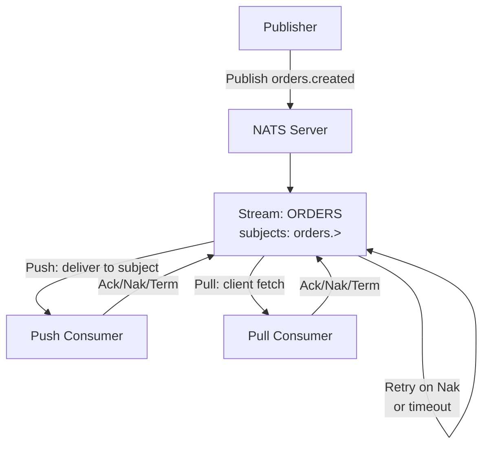
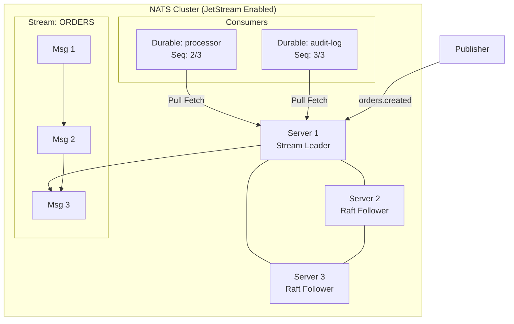
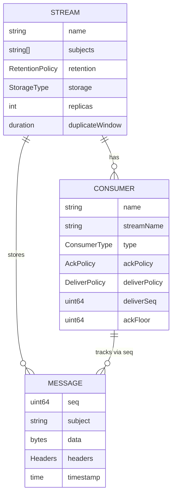

#nats #jetstream #streaming

相关笔记：[[nats-basics]] | [[kafka-basics]] | [[kafka-interview]]

# NATS JetStream 持久化与流处理

## JetStream 是什么

JetStream 是 NATS 的**内置持久化消息层**，从 NATS Server 2.2 开始内置。它在 Core NATS 的基础上增加了：

- **消息持久化**：存储到磁盘或内存
- **消息回溯**：Consumer 可以从任意历史位置消费
- **消费确认（Ack）**：at-least-once 和 exactly-once 语义
- **流量控制**：背压（Backpressure）、速率限制
- **Key-Value Store / Object Store**：基于 Stream 的高级抽象

启用 JetStream：

```bash
nats-server -js
# 或在配置文件中
# jetstream: enabled
```

---

## 核心概念

### Stream（流）

Stream 是消息的持久化容器，订阅一组 Subject 的消息：

```
Stream "ORDERS" 订阅: orders.>
  → 接收所有 orders.created, orders.updated, orders.deleted 等消息
  → 消息按序存储，每条消息有全局唯一的 Sequence Number
```

- 一个 Stream 可以订阅多个 Subject（支持通配符）
- 消息在 Stream 中是不可变的，追加写入

### Consumer（消费者）

Consumer 是 Stream 上的消费视图，记录消费进度：

- **Durable Consumer**：有名字，断开重连后消费进度保留
- **Ephemeral Consumer**：无名字，连接断开后自动删除
- **Push Consumer**：Server 主动推送消息给订阅者
- **Pull Consumer**：客户端主动 Fetch 消息（推荐，更好的流量控制）

### Message Retention（消息保留）

Consumer 消费后，消息**不会立即删除**，由 Retention Policy 决定何时删除。

---

## Stream 配置

### Retention Policy（保留策略）

| 策略 | 说明 | 适用场景 |
|------|------|----------|
| `LimitsPolicy`（默认） | 按消息数量/大小/时间限制，超限自动删除 | 日志、事件流 |
| `InterestPolicy` | 所有 Durable Consumer 都 Ack 后删除 | 确保每个消费方都处理过 |
| `WorkQueuePolicy` | 任意一个 Consumer Ack 后删除 | 任务队列，确保只处理一次 |

### Storage（存储类型）

| 类型 | 说明 |
|------|------|
| `FileStorage`（默认） | 持久化到磁盘，重启不丢失 |
| `MemoryStorage` | 仅内存，重启丢失，速度最快 |

### Replication（副本）

```
Replicas: 3  # 消息在 3 个 Server 上冗余存储，使用 Raft 保证一致性
```

副本数为 1 时没有冗余，建议生产环境设置为 3（需要 3 节点集群）。

---

## Consumer 类型详解

### Durable vs Ephemeral

```go
// Durable Consumer：有名字，消费进度持久化
js.AddConsumer("ORDERS", &nats.ConsumerConfig{
    Durable:   "order-processor",  // 重连后继续从上次位置消费
    AckPolicy: nats.AckExplicitPolicy,
})

// Ephemeral Consumer：无 Durable 名字，连接断开后自动删除
js.AddConsumer("ORDERS", &nats.ConsumerConfig{
    AckPolicy: nats.AckExplicitPolicy,
    // 不设置 Durable，Server 自动生成随机名
})
```

### Push Consumer

Server 主动向指定 Subject 推送消息：

```go
// Push Consumer：Server 推送到 DeliverSubject
sub, err := js.SubscribeSync("orders.>",
    nats.Durable("push-consumer"),
    nats.DeliverNew(), // 只消费新消息
)
msg, err := sub.NextMsg(5 * time.Second)
msg.Ack()
```

缺点：消费者处理不过来时会有积压压力，需要客户端实现背压控制。

### Pull Consumer

客户端主动 Fetch，天然背压控制：

```go
// Pull Consumer：客户端控制拉取速度
sub, err := js.PullSubscribe("orders.>", "pull-consumer")

// 每次最多拉取 10 条，等待最多 5 秒
msgs, err := sub.Fetch(10, nats.MaxWait(5*time.Second))
for _, msg := range msgs {
    // 处理消息
    fmt.Println(string(msg.Data))
    msg.Ack() // 确认消费
}
```

---

## Consumer 流程



### Ack 类型

| Ack | 说明 |
|-----|------|
| `Ack()` | 确认处理成功，消息从 Consumer 视图移除 |
| `Nak()` | 处理失败，要求重新投递 |
| `InProgress()` | 还在处理中，重置 AckWait 计时器 |
| `Term()` | 终止，不再重试 |

---

## Exactly-once 实现

### Message Deduplication（消息去重）

发布时携带唯一的 `Msg-Id` Header，JetStream 在配置的去重窗口内拒绝重复消息：

```go
// 发布时设置 Msg-Id
msg := nats.NewMsg("orders.created")
msg.Header.Set(nats.MsgIdHdr, "order-12345-v1") // 幂等 ID
msg.Data = []byte(`{"order_id":"12345"}`)
ack, err := js.PublishMsg(msg)
// 重复发布相同 Msg-Id，Server 返回 Dup=true，不重复存储
```

Stream 配置去重窗口：

```go
js.AddStream(&nats.StreamConfig{
    Name:       "ORDERS",
    Subjects:   []string{"orders.>"},
    Duplicates: 5 * time.Minute, // 5 分钟内的重复消息被丢弃
})
```

### Double-Ack（双重确认）

消费端使用 `AckSync()` 等待 Server 确认 Ack 已持久化，防止网络丢失 Ack 导致重复投递：

```go
// 普通 Ack：fire-and-forget，可能丢失
msg.Ack()

// Double-Ack：等待 Server 确认 Ack 收到
err := msg.AckSync()
```

组合使用 Msg-Id 去重 + AckSync = Exactly-once 语义。

---

## Key-Value Store（JetStream KV）

JetStream KV 是基于 Stream 实现的分布式键值存储：

- 支持 Put、Get、Delete、Purge 操作
- 支持键的历史版本（History）
- 支持 Watch（监听键变更，类似 etcd Watch）
- 支持 TTL

```go
// 创建 KV Bucket
kv, err := js.CreateKeyValue(&nats.KeyValueConfig{
    Bucket:  "configs",
    History: 5,           // 保留最近 5 个版本
    TTL:     time.Hour,   // 键的默认 TTL
})

// Put
kv.Put("app.timeout", []byte("30s"))

// Get
entry, err := kv.Get("app.timeout")
fmt.Println(string(entry.Value())) // 30s

// Watch 单个键
watcher, err := kv.Watch("app.timeout")
for entry := range watcher.Updates() {
    if entry != nil {
        fmt.Printf("键变更: %s = %s\n", entry.Key(), entry.Value())
    }
}
```

**典型用途**：服务配置中心、分布式锁（配合 CAS 操作）、Leader 选举。

---

## Object Store（JetStream Object Store）

用于存储大文件（二进制对象），基于 Stream 分块存储：

```go
// 创建 Object Store Bucket
obs, err := js.CreateObjectStore(&nats.ObjectStoreConfig{
    Bucket: "artifacts",
})

// 上传文件
obs.PutFile("config.yaml", "/path/to/config.yaml")

// 下载文件
obs.GetFile("config.yaml", "/path/to/output.yaml")

// 列出所有对象
objects, err := obs.List()
for _, info := range objects {
    fmt.Printf("%s: %d bytes\n", info.Name, info.Size)
}
```

---

## JetStream 架构图



---

## Stream-Consumer 关系图



---

## JetStream vs Kafka 详细对比

| 特性 | JetStream | Kafka |
|------|-----------|-------|
| 消息模型 | Stream（逻辑流） | Topic + Partition（物理分片） |
| 消费模型 | Push / Pull Consumer | Pull（Consumer Group） |
| 并发单元 | Consumer 数量（无限制） | Partition 数量（上限） |
| 顺序保证 | Stream 内全局有序 | Partition 内有序 |
| 消费组 | Durable Consumer（多个） | Consumer Group（固定分配） |
| Exactly-once | Msg-Id 去重 + AckSync | Transactions + Idempotent Producer |
| 消息回溯 | DeliverPolicy（time/seq/last） | Offset Reset |
| 延迟 | 毫秒级 | 毫秒级（但 Kafka 调优更复杂） |
| 横向扩展 | 受限于 Stream 副本数 | 增加 Partition 线性扩展 |
| 部署 | 单二进制，内置 JetStream | Broker + ZooKeeper/KRaft |
| 消息大小 | 推荐 < 1MB（默认上限 1MB） | 默认 1MB，可调到 GB 级 |
| 长期存储 | 支持（受磁盘限制） | 优秀（设计用于 TB 级数据） |
| 生态 | 较小 | 成熟（Kafka Connect, Streams） |

**核心差异**：Kafka 以 Partition 为并发单元，扩展吞吐需要预先规划 Partition 数；JetStream Pull Consumer 不受分区限制，动态扩缩容更简单，但极大规模场景（亿级消息/天）Kafka 更成熟。

---

## Go 完整示例

```go
package main

import (
    "context"
    "fmt"
    "log"
    "time"

    "github.com/nats-io/nats.go"
)

func main() {
    // 连接
    nc, err := nats.Connect(nats.DefaultURL)
    if err != nil {
        log.Fatal(err)
    }
    defer nc.Drain()

    js, err := nc.JetStream()
    if err != nil {
        log.Fatal(err)
    }

    // ===== 1. 创建 Stream =====
    _, err = js.AddStream(&nats.StreamConfig{
        Name:       "ORDERS",
        Subjects:   []string{"orders.>"},
        Retention:  nats.LimitsPolicy,
        Storage:    nats.FileStorage,
        Replicas:   1,
        MaxAge:     24 * time.Hour,  // 消息最多保留 24 小时
        MaxMsgs:    100_000,         // 最多 10 万条消息
        Duplicates: 5 * time.Minute, // 5 分钟去重窗口
    })
    if err != nil {
        log.Printf("Stream 已存在或创建失败: %v", err)
    }

    // ===== 2. 发布消息（带 Msg-Id 去重）=====
    for i := 1; i <= 5; i++ {
        msg := nats.NewMsg(fmt.Sprintf("orders.created"))
        msg.Header.Set(nats.MsgIdHdr, fmt.Sprintf("order-%d", i))
        msg.Data = []byte(fmt.Sprintf(`{"order_id":%d,"amount":%.2f}`, i, float64(i)*10.5))

        ack, err := js.PublishMsg(msg)
        if err != nil {
            log.Printf("发布失败: %v", err)
            continue
        }
        fmt.Printf("发布成功: stream=%s, seq=%d\n", ack.Stream, ack.Sequence)
    }

    // ===== 3. 创建 Pull Consumer =====
    _, err = js.AddConsumer("ORDERS", &nats.ConsumerConfig{
        Durable:       "order-processor",
        AckPolicy:     nats.AckExplicitPolicy,
        DeliverPolicy: nats.DeliverAllPolicy, // 从头消费
        AckWait:       30 * time.Second,      // 30 秒未 Ack 则重投
        MaxDeliver:    3,                     // 最多重投 3 次
    })
    if err != nil {
        log.Printf("Consumer 已存在: %v", err)
    }

    sub, err := js.PullSubscribe("orders.>", "order-processor")
    if err != nil {
        log.Fatal(err)
    }
    defer sub.Unsubscribe()

    // ===== 4. Pull 消费 =====
    ctx, cancel := context.WithTimeout(context.Background(), 10*time.Second)
    defer cancel()

    for {
        select {
        case <-ctx.Done():
            fmt.Println("消费完成，退出")
            return
        default:
        }

        msgs, err := sub.Fetch(10, nats.MaxWait(2*time.Second))
        if err != nil {
            if err == nats.ErrTimeout {
                fmt.Println("无更多消息")
                return
            }
            log.Printf("Fetch 错误: %v", err)
            continue
        }

        for _, msg := range msgs {
            fmt.Printf("消费消息: subject=%s, data=%s\n", msg.Subject, string(msg.Data))

            // Double-Ack：等待 Server 确认
            if err := msg.AckSync(); err != nil {
                log.Printf("AckSync 失败: %v", err)
                msg.Nak() // 让 Server 重新投递
            }
        }
    }
}
```

---

## 面试要点

### Q1：JetStream Stream 和 Kafka Topic 的本质区别？

> [!question]- 参考答案（点击展开）
>
> Kafka Topic 是物理分片的，并发消费能力由 Partition 数量决定，Consumer 数量不能超过 Partition 数量（超出的 Consumer 空闲）。JetStream Stream 是逻辑流，没有分区概念，Pull Consumer 数量不受限制，多个 Consumer 可以同时拉取，Server 按 Consumer 的消费进度独立管理。Kafka 的顺序保证在 Partition 级别，JetStream 的顺序保证在 Stream 级别（全局有序）。

### Q2：JetStream 的三种 Retention Policy 分别用在什么场景？

> [!question]- 参考答案（点击展开）
>
> - `LimitsPolicy`：最常用，按数量/大小/时间淘汰旧消息，适合日志、事件流（消费方可能错过部分消息）。
> - `InterestPolicy`：所有 Durable Consumer 都 Ack 才删除消息，确保每个消费方都处理过，适合审计日志、多消费方通知。
> - `WorkQueuePolicy`：任意一个 Consumer Ack 即删除，适合任务队列（确保任务只被处理一次，类似 RabbitMQ 队列）。

### Q3：Push Consumer 和 Pull Consumer 如何选择？

> [!question]- 参考答案（点击展开）
>
> 生产环境推荐 **Pull Consumer**。Pull Consumer 由客户端控制拉取速度，天然支持背压，处理能力不足时不会被消息淹没。Push Consumer 由 Server 推送，速度由 Server 决定，客户端需要额外实现背压逻辑（`FlowControl`、`RateLimit`）。唯一适合 Push 的场景是需要极低延迟且消费者处理能力充足的情况。

### Q4：如何实现 Exactly-once？

> [!question]- 参考答案（点击展开）
>
> 两步保证：
> 1. **发布端去重**：每条消息携带唯一 `Nats-Msg-Id` Header，JetStream 在 `Duplicates` 时间窗口内拒绝相同 ID 的消息（即使 Publisher 重试也不会重复存储）。
> 2. **消费端精确确认**：使用 `AckSync()` 替代 `Ack()`，等待 Server 确认 Ack 已持久化，避免网络丢失 Ack 后 Server 重复投递。

### Q5：JetStream KV Store 和 etcd / Redis 的适用场景区别？

> [!question]- 参考答案（点击展开）
>
> JetStream KV 基于 NATS JetStream 实现，优势是不引入额外组件（如果已经使用 NATS），支持 Watch 键变更、历史版本、TTL。适合配置下发、特性开关等场景。etcd 提供更强的一致性保证（线性化读）和更完善的 Watch 语义，Kubernetes 依赖它。Redis 单机性能极高，支持丰富数据结构。选择原则：已有 NATS 基础设施时优先 JetStream KV；需要强一致性分布式协调选 etcd；需要高性能缓存选 Redis。

### Q6：JetStream 的消息去重窗口（Duplicates）有什么限制？

> [!question]- 参考答案（点击展开）
>
> 去重窗口是时间范围（如 5 分钟），Server 在内存中维护这段时间内所有消息的 Msg-Id 哈希表。超过时间窗口的消息 ID 不再去重，如果 Publisher 在窗口期外重试，可能产生重复。因此发布端需要保证在窗口期内的重试使用相同 Msg-Id，窗口期的长短需要根据发布端最大重试时间来设置。

### Q7：JetStream 的 DeliverPolicy 有哪些选项？

> [!question]- 参考答案（点击展开）
>
> - `DeliverAllPolicy`：从 Stream 的第一条消息开始消费（默认）
> - `DeliverLastPolicy`：只消费最新的一条消息
> - `DeliverNewPolicy`：只消费 Consumer 创建之后的新消息
> - `DeliverByStartSequencePolicy`：从指定 Sequence 开始消费
> - `DeliverByStartTimePolicy`：从指定时间点开始消费
> - `DeliverLastPerSubjectPolicy`：每个 Subject 各取最后一条消息

### Q8：JetStream 适合替代 Kafka 吗？什么情况下不建议替换？

> [!question]- 参考答案（点击展开）
>
> JetStream 在大多数中小规模场景可以替代 Kafka：部署更简单、延迟更低、运维成本低。但以下场景**不建议替换**：
> 1. **超大规模数据**：日均数百 GB 甚至 TB 级日志，Kafka 的 Partition 机制和 Log Compaction 更成熟。
> 2. **依赖 Kafka 生态**：已使用 Kafka Connect、Kafka Streams、ksqlDB，迁移成本极高。
> 3. **精确 Partition 顺序**：某些场景依赖同一 key 的消息严格顺序路由到固定 Partition，JetStream 无 Partition 概念。
> 4. **监控体系**：Kafka 的 Prometheus 指标、Kafka UI 工具链更完善。
