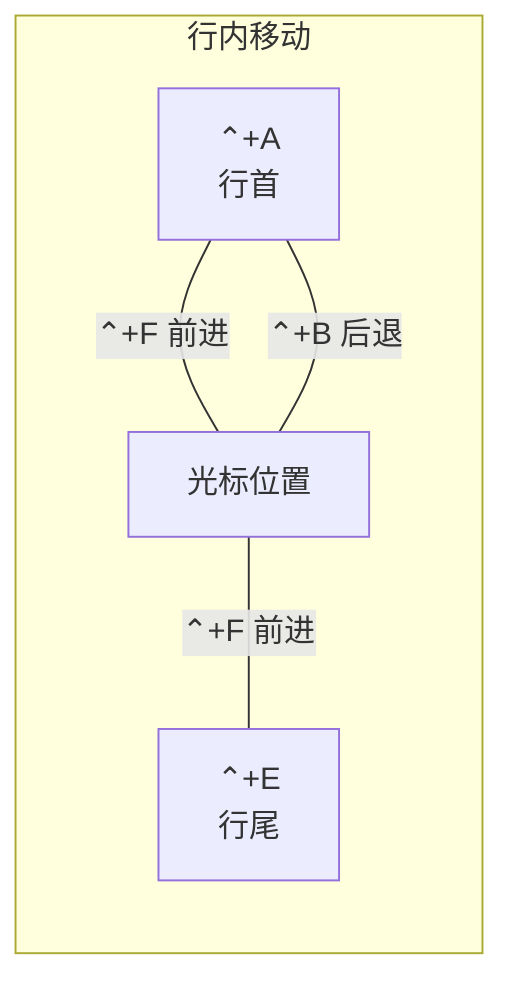

#terminal #zsh #快捷键

## Zsh / iTerm2 常用快捷键

### 行编辑（Ctrl 系列）

| 快捷键 | 功能 | 助记 |
|--------|------|------|
| `⌃ + A` | 移动到行首 | **A**head |
| `⌃ + E` | 移动到行尾 | **E**nd |
| `⌃ + F` | 向前移动一个字符 | **F**orward |
| `⌃ + B` | 向后移动一个字符 | **B**ack |
| `⌃ + U` | 清空当前行（光标前） | |
| `⌃ + K` | 删除从光标到行尾 | **K**ill |
| `⌃ + W` | 删除光标前一个单词 | **W**ord |
| `⌃ + H` | 删除光标前一个字符 | 等价 Backspace |
| `⌃ + D` | 删除光标处字符 | **D**elete |
| `⌃ + T` | 交换光标前后字符 | **T**ranspose |
| `⌃ + Y` | 粘贴最近删除的文字 | **Y**ank |

### 历史命令

| 快捷键 | 功能 | 助记 |
|--------|------|------|
| `⌃ + P` | 上一条命令 | **P**revious |
| `⌃ + N` | 下一条命令 | **N**ext |
| `⌃ + R` | 反向搜索历史命令 | **R**everse search |

### iTerm2 窗口管理（Cmd 系列）

| 快捷键 | 功能 |
|--------|------|
| `⌘ + N` | 新建窗口 |
| `⌘ + T` | 新建标签页 |
| `⌘ + W` | 关闭当前页 |
| `⌘ + 数字` / `⌘ + 方向键` | 切换标签页 |
| `⌥⌘ + 数字` | 切换窗口 |
| `⌘ + Enter` | 切换全屏 |
| `⌘ + D` | 左右分屏 |
| `⇧⌘ + D` | 上下分屏 |
| `⌘ + R` / `⌃ + L` | 清屏 |
| `⌘ + /` | 显示光标位置 |
| `⌘ + Click` | 打开文件 / 文件夹 / 链接 |

### iTerm2 高级功能

| 快捷键 | 功能 |
|--------|------|
| `⌘ + ;` | 自动补全历史记录 |
| `⇧⌘ + H` | 剪贴板历史 |
| `⌥⌘ + E` | 搜索所有标签页 |
| `⌥⌘ + B` | 历史回放（Instant Replay） |
| `⌘ + F` | 查找（`Tab` / `⇧Tab` 补全，`⌥Enter` 输入终端） |

### 光标移动速查

