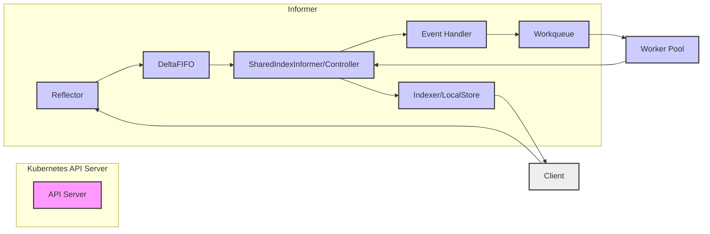

#kubernetes 
## Kubernetes Informer 机制深度解析报告：数据一致性保障与应用实践

### 引言

Kubernetes Informer 机制是构建 Kubernetes 控制器和 Operator 的核心组件，它负责高效地监听 Kubernetes API Server 中的资源变化，并将这些变化同步到本地缓存，从而为控制器提供快速、可靠的数据来源。在 Kubernetes 架构中，数据一致性至关重要，Informer 机制不仅需要及时同步数据，更要保证本地缓存与 API Server 数据的一致性。本报告将深入剖析 Kubernetes Informer 机制，重点探讨其数据一致性保障机制，并结合实际应用场景和源码分析，全面解读 Informer 的工作原理、性能优化、最佳实践以及未来研究方向。

### Informer 核心机制：构建数据同步的基石

Informer 机制的核心目标是解决 Kubernetes 组件与 API Server 之间高效、可靠的数据同步问题。传统的轮询方式会给 API Server 带来巨大压力，且实时性较差。Informer 通过 **List-Watch 机制**，实现了高效的事件驱动型数据同步。

#### List-Watch 机制：事件驱动的数据同步

List-Watch 机制是 Kubernetes 的精髓之一，也是 Informer 机制的基础。它结合了 **List（全量同步）** 和 **Watch（增量更新）** 两种操作，既保证了初始数据的完整性，又实现了后续变化的实时同步。

* **List 操作：** Informer 启动时，首先通过 List 操作从 API Server 获取指定资源的全量数据，并将其存储在本地缓存中。这相当于一次全量同步，确保了 Informer 初始状态与 API Server 的一致性。
* **Watch 操作：** 在 List 操作之后，Informer 建立与 API Server 的 Watch 连接。API Server 会持续监听资源变化，并将发生的事件（例如资源的添加、修改、删除）通过 Watch 连接实时推送给 Informer。Informer 根据接收到的事件，增量更新本地缓存，保持与 API Server 的数据同步。

List-Watch 机制避免了客户端组件频繁轮询 API Server，极大地降低了 API Server 的压力，同时保证了数据同步的实时性。这种机制是 Kubernetes 声明式 API 的基础，也是构建各种控制器的关键。

#### Informer 核心组件：协同工作的保障

Informer 机制并非单一组件，而是由多个组件协同工作，共同完成数据同步和事件处理。其核心组件包括：

* **Reflector（反射器）：** Reflector 负责与 API Server 进行 ListAndWatch 操作，从 API Server 获取资源对象的增量事件，并将事件推送到 **DeltaFIFO（增量先进先出队列）** 中。Reflector 是 Informer 与 API Server 交互的桥梁。
* **DeltaFIFO（增量队列）：** DeltaFIFO 是一个本地缓存队列，用于存储从 Reflector 接收到的增量事件（Delta）。DeltaFIFO 具有去重、排序等功能，保证事件的有序性和可靠性。
* **Indexer（索引器）/LocalStore：** Indexer 或 LocalStore 是 Informer 的本地缓存，用于存储从 API Server 同步的资源对象。Indexer 提供了索引功能，可以根据不同的字段快速检索资源对象。
* **Controller（控制器）/SharedIndexInformer：** Controller 或 SharedIndexInformer 负责从 DeltaFIFO 中消费事件，并根据事件类型（Add、Update、Delete）更新 Indexer 中的本地缓存。同时，Controller 还会将事件通知给注册的 **事件处理器（Handler）**。
* **SharedInformerFactory（共享 Informer 工厂）：** SharedInformerFactory 用于创建和管理多个 SharedInformer 实例。在复杂的控制器场景中，通常需要监听多种资源对象，SharedInformerFactory 可以方便地创建和共享 Informer 实例，提高资源利用率。
* **Workqueue（工作队列）：** Workqueue 通常与 Informer 协同工作，用于处理事件处理器产生的任务。事件处理器通常只是将事件信息放入 Workqueue，由独立的 Worker 线程从 Workqueue 中取出任务并执行具体的业务逻辑，例如 reconcile 操作。

下图展示了 Informer 机制的核心组件及其协同工作流程：

### 数据一致性保障机制：多重策略确保可靠性

Informer 机制为了保证本地缓存与 API Server 数据的一致性，采用了多重策略，包括 List-Watch 机制本身、Resync 机制、ResourceVersion 机制以及 DeltaFIFO 的可靠性保障。

#### List-Watch 机制的内在一致性

List-Watch 机制本身就为数据一致性提供了基础保障。

* **初始全量同步 (List)：**  通过 List 操作，Informer 获取了资源的完整快照，作为数据同步的起点。
* **增量事件同步 (Watch)：**  Watch 连接保证了后续资源变化的实时推送，使得 Informer 可以及时更新本地缓存，避免数据滞后。

然而，网络抖动、API Server 压力等因素可能导致 Watch 连接中断或事件丢失。为了应对这些情况，Informer 引入了 Resync 机制。

#### Resync 机制：周期性数据校对

Resync 机制是 Informer 保证数据一致性的重要手段。它通过 **定期执行 List 操作**，重新获取全量数据，并与本地缓存进行比对，从而发现并纠正由于 Watch 连接中断或事件丢失导致的数据不一致问题。

最初的理解可能认为 Resync 是 Controller 定时与 API Server 同步，以保证数据一致性。但实际上，Resync 处理的是最近两次 List 结果不一致的情况。需要注意的是，早期的 Informer 设计中，`relist` 操作无法触发 `resync`，但后来这个问题被修复。

Resync 周期可以通过 `resyncPeriod` 参数配置。合理的 Resync 周期需要在数据一致性和 API Server 压力之间进行权衡。周期过短会增加 API Server 压力，周期过长则可能导致数据不一致的时间窗口增大。

#### ResourceVersion：乐观并发控制与优化

ResourceVersion 是 Kubernetes 中用于实现乐观并发控制和数据版本管理的重要字段。每个 Kubernetes 资源对象都有一个 ResourceVersion 字段，每次资源更新时，ResourceVersion 都会递增。

Informer 在 List 和 Watch 操作中都使用了 ResourceVersion。

* **List 操作：**  Informer 在执行 List 操作时，可以指定 ResourceVersion 参数。如果指定了 ResourceVersion，API Server 只会返回 ResourceVersion 大于指定值的资源对象。这可以用于增量 List，减少数据传输量。
* **Watch 操作：**  Watch 操作会基于上次 List 或 Watch 操作返回的 ResourceVersion 开始监听，API Server 只会推送 ResourceVersion 大于该值的事件。

在 Informer 的事件处理中，对比 ResourceVersion 可以优化 reconcile 过程。虽然跳过 ResourceVersion 对比可能导致 reconcile 过程执行更多不必要的操作，但最终结果不受影响。Kubernetes 源码中部分地方有对比 ResourceVersion 的步骤，部分地方没有，这取决于具体的场景和优化目标。

ResourceVersion 不仅用于数据一致性，也用于性能优化。通过合理使用 ResourceVersion，可以减少不必要的数据传输和处理，提高 Informer 的效率。

#### DeltaFIFO 的可靠性保障

DeltaFIFO 作为事件队列，其可靠性直接影响 Informer 的数据一致性。DeltaFIFO 采取了多种机制来保证事件的可靠性：

* **队列加锁处理 (queueActionLocked)：**  DeltaFIFO 使用锁机制保证队列操作的原子性，避免并发访问导致的数据错乱。
* **事件去重 (dedupDeltas)：**  DeltaFIFO 可以自动去重重复的事件，例如在短时间内收到多个相同的更新事件，DeltaFIFO 只会保留一个，避免重复处理。
* **本地缓存 (items)：**  DeltaFIFO 使用本地缓存存储事件数据，即使在网络中断或 API Server 暂时不可用的情况下，已经接收到的事件也不会丢失。
* **Pop 操作消费：**  DeltaFIFO 通过 Pop 操作不断消费队列中的事件，保证事件被及时处理。

通过以上多重机制，DeltaFIFO 保证了事件的可靠存储和有序消费，为 Informer 的数据一致性提供了重要保障。

### SharedInformer 的优势与性能优化

SharedInformer 是对 Informer 的封装和扩展，它允许多个控制器共享同一个 Informer 实例，监听和缓存相同的资源对象。SharedInformer 的主要优势在于 **提高资源利用率，降低 API Server 压力**。

在传统的 Informer 使用方式中，每个控制器都需要创建自己的 Informer 实例，监听相同的资源对象。当控制器数量较多时，会产生大量的 List 和 Watch 请求，给 API Server 带来巨大压力。SharedInformer 通过共享机制，只需要创建一个 Informer 实例，多个控制器可以共享该实例的缓存和事件通知，从而大大减少了 API Server 的请求次数。

SharedInformerFactory 用于创建和管理 SharedInformer 实例。通过 `SharedInformerFactory.InformerFor` 注册目标 Informer，然后调用 `SharedInformerFactory.Start` 启动 SharedIndexedInformer -> Controller -> Reflector -> DeltaFIFO 流程。

**性能优化方向：**

* **API Server 优化：**  API Server 的性能直接影响 Informer 的效率。可以通过参数调整、etcd 多实例支持负载均衡、API Server 负载均衡等方式优化 API Server 性能。可以使用 `pprof` 等工具进行性能分析。
* **kube-controller-manager 优化：**  `kube-controller-manager` 是 Kubernetes 控制器的核心组件。可以通过参数优化、kube-controller-manager 升级过程 informer 预加载等方式优化 `kube-controller-manager` 性能。
* **kube-scheduler 优化：**  `kube-scheduler` 是 Kubernetes 调度器组件。可以通过参数优化、调度器优化等方式优化 `kube-scheduler` 性能。
* **代码优化：**  优化事件处理函数（Handler）的效率，减少资源消耗。
* **监控和调优：**  使用 Prometheus 等性能监控工具来评估和优化 Informer 的性能。关注关键指标，例如 List 和 Watch 的延迟、事件处理速度等。
* **事件丢失处理：**  针对 Informer 可能丢失事件的情况，采用容错机制或补偿策略。
* **大规模集群优化：**  在大规模 Kubernetes 集群中，Informer 的性能瓶颈可能更加突出。需要针对性地进行优化，例如减少 List 和 Watch 的频率、优化数据传输格式等。
* **DeltaFIFO 深度分析：**  深入研究 DeltaFIFO 的实现原理，分析其在 Informer 性能中的作用和潜在瓶颈。
* **ListAndWatch 机制优化：**  探索优化 ListAndWatch 操作的方法，例如减少请求频率、优化数据传输格式等。

### Informer 在 Operator 开发中的应用

Kubernetes Operator 是一种用于自动化和简化 Kubernetes 集群中复杂应用程序管理的模式。Operator 通过扩展 Kubernetes API，利用自定义资源（CR）和自定义控制器（Controller）来实现应用程序的生命周期管理。Informer 机制是构建 Operator 控制器的核心组件。

Operator 的核心工作原理是 **监听 CR 的变化，并根据 CR 的状态驱动应用程序的状态迁移**。Informer 机制可以帮助 Operator 控制器高效地监听 CR 的变化，并将变化事件通知给控制器，从而触发 reconcile 逻辑。

**Operator 中 Informer 的应用要点：**

* **监听 CRD：**  Operator 控制器需要监听自定义资源定义（CRD）的变化，以便及时响应 CR 的创建、更新和删除事件。Informer 可以用于监听 CRD 资源。
* **多资源协同：**  复杂的 Operator 可能需要管理多个 Kubernetes 资源对象，例如 Deployment、Service、StatefulSet 等。SharedInformerFactory 可以方便地创建和管理多个 Informer 实例，监听多种资源对象，实现多资源协同管理。
* **状态机管理：**  Operator 通常需要维护应用程序的状态机，根据应用程序的当前状态和 CR 的期望状态，执行相应的操作。Informer 提供的事件通知机制可以驱动状态机的状态迁移。
* **Operator SDK：**  Operator SDK 等工具提供了抽象和封装，可以简化 Informer 的使用和 Operator 的开发。Operator SDK 可以自动生成 Informer 代码，并提供用于处理事件的回调函数，降低 Operator 开发的门槛。

### Informer 源码分析：深入理解实现细节

深入理解 Informer 机制的源码，可以帮助我们更好地掌握其工作原理，并进行更高级的定制和优化。`client-go` 库是 Kubernetes 官方提供的 Go 语言客户端库，其中包含了 Informer 机制的完整实现。

**源码分析要点：**

* **`client-go`** **库结构：**  了解 `client-go` 库的模块结构，重点关注 `informer`、`reflector`、`cache` 等核心模块。
* **`SharedInformerFactory`、`SharedInformer`、`Controller`** **源码：**  深入分析这些核心组件的源码，理解它们之间的关系和协作方式。
* **`Reflector`** **的** **`ListAndWatch`** **操作实现：**  详细研究 `ListAndWatch` 操作的实现细节，例如如何处理连接中断、如何进行重试、如何使用 ResourceVersion 等。
* **`DeltaFIFO`** **的实现：**  深入研究 `DeltaFIFO` 的实现原理，理解其队列操作、事件去重、本地缓存等机制。
* **`Indexer`** **的实现：**  研究 `Indexer` 的索引结构和索引操作，了解如何高效地存储和检索资源对象。
* **事件处理流程：**  详细分析事件从 API Server 到 `DeltaFIFO`，再到 `Informer` 的处理流程，理解每个环节的作用。
* **并发控制、错误处理机制：**  探索 Informer 源码中使用的并发控制、错误处理等机制，学习如何编写健壮的并发程序。
* **Resync 机制源码：**  深入理解 `Resync` 机制的源码实现，例如 `ResyncPeriod` 的设置、`Resync` 操作的触发条件等。

通过源码分析，我们可以更深入地理解 Informer 机制的内部工作原理，为性能优化、问题排查和定制开发提供更强的技术支撑。

### Informer 与 Workqueue 协同工作：事件处理的流水线

Informer 机制通常与 Workqueue 协同工作，共同完成事件处理流程。Informer 负责监听和缓存资源变化，Workqueue 负责事件的异步处理和任务调度。

**协同工作流程：**

1. **Informer 监听事件：**  Informer 通过 List-Watch 机制监听 Kubernetes API Server 的资源变化，并将事件放入 DeltaFIFO 队列。
2. **事件处理器入队：**  Informer 的 Controller 组件从 DeltaFIFO 中消费事件，并调用注册的事件处理器（Handler）。事件处理器通常会将事件的关键信息（例如资源对象的 Namespace 和 Name）放入 Workqueue。
3. **Workqueue 任务调度：**  Workqueue 负责任务的排队、去重、重试和限速等功能。Worker 线程从 Workqueue 中取出任务，并执行具体的业务逻辑，例如 reconcile 操作。
4. **Worker 执行业务逻辑：**  Worker 线程根据任务信息，从 Informer 的本地缓存中获取资源对象，并执行 reconcile 逻辑，例如更新资源状态、创建或删除子资源等。

Workqueue 在 Informer 机制中扮演着重要的角色，它将事件的监听和处理解耦，实现了异步、可靠的事件处理流水线。Workqueue 提供了多种队列实现，例如 DelayingQueue、RateLimitingQueue 等，可以满足不同场景下的需求。

**Workqueue 研究方向：**

* **Workqueue 不同实现：**  深入研究 DelayingQueue、RateLimitingQueue 等 Workqueue 的不同实现，以及它们在 Informer 应用中的选择和使用场景。
* **Workqueue 定制：**  探索如何根据具体的应用场景，定制 Workqueue 的参数和行为，例如最大重试次数、速率限制等。
* **Workqueue 性能优化：**  研究 Workqueue 的性能特点以及在大规模事件处理场景下的优化策略。

### Informer 最佳实践与常见错误

合理使用 Informer 机制可以提高控制器的效率和可靠性，但如果不当使用，也可能导致各种问题。以下总结了一些 Informer 的最佳实践和常见错误：

**最佳实践：**

* **使用 SharedInformer：**  在多个控制器需要监听相同资源对象时，优先使用 SharedInformer，减少 API Server 压力。
* **合理配置 Resync 周期：**  根据应用场景和数据一致性要求，合理配置 Resync 周期，在数据一致性和 API Server 压力之间进行权衡。
* **事件处理幂等性：**  事件处理函数（Handler）需要保证幂等性，避免重复处理事件导致状态错误。
* **错误处理策略：**  在事件处理函数中加入完善的错误处理逻辑，例如重试机制、死信队列等，保证事件处理的可靠性。
* **资源清理：**  在控制器停止或退出时，需要及时清理 Informer 资源，例如关闭 Watch 连接、清空本地缓存等，避免资源泄露。
* **监控和告警：**  建立完善的 Informer 监控和告警机制，及时发现和解决问题。

**常见错误：**

* **事件处理逻辑错误：**  事件处理函数逻辑错误是 Informer 应用中最常见的错误，例如资源泄露、状态更新错误、死循环等。
* **缓存不一致问题：**  由于 Resync 周期配置不当或网络问题，可能导致 Informer 本地缓存与 API Server 数据不一致。
* **过度依赖本地缓存：**  Informer 的本地缓存只是一个快照，不能完全替代 API Server 的权威数据源。在关键业务逻辑中，仍然需要直接从 API Server 获取数据进行校验。
* **性能问题：**  不合理的 Informer 使用方式可能导致性能问题，例如频繁的 List 和 Watch 请求、低效的事件处理函数等。
* **忽略错误处理：**  在事件处理函数中忽略错误处理，可能导致程序崩溃或状态异常。

**研究方向：**

* **实际应用中的错误案例分析：**  收集并分析实际应用中 Informer 常见的错误案例，总结错误模式和预防方法。
* **最佳实践指南：**  编写更详细、更全面的 Informer 使用最佳实践指南，帮助开发者避免常见错误。
* **预防和检测方法：**  研究如何使用静态代码分析、单元测试、集成测试等方法来预防和检测 Informer 使用中的错误。

### 未来研究方向

随着 Kubernetes 的不断发展和应用场景的扩展，Informer 机制也面临着新的挑战和机遇。未来的研究方向可以包括：

* **Informer 性能优化：**  在大规模集群和高并发场景下，Informer 的性能优化仍然是一个重要的研究方向。可以探索更高效的缓存结构、更优化的 List-Watch 策略、更智能的 Resync 机制等。
* **Informer 在边缘计算中的应用：**  在边缘计算场景中，网络环境复杂多变，对数据同步的可靠性和效率提出了更高的要求。可以研究如何将 Informer 应用于边缘计算场景，例如在边缘节点上缓存 Kubernetes 资源对象，减少对中心集群的依赖。
* **Informer 与 Service Mesh 的集成：**  Service Mesh 关注服务间的流量管理和安全控制。可以研究如何将 Informer 与 Service Mesh 集成，实现对服务流量的动态调整和控制，例如基于 Kubernetes 资源状态进行流量路由和负载均衡。
* **Informer 的安全性：**  随着 Kubernetes 安全性的日益重要，Informer 的安全性也需要得到更多关注。可以研究如何防止恶意用户篡改缓存数据、防止信息泄露等安全问题。
* **Informer 的监控和告警：**  建立更完善的 Informer 监控和告警机制，可以帮助开发者及时发现和解决问题，保障系统的稳定运行。
* **自定义 Informer 的实现：**  针对特定场景的需求，可以研究如何自定义 Informer，例如监控自定义资源对象、实现更复杂的事件处理逻辑等。

### 结论

Kubernetes Informer 机制是构建 Kubernetes 控制器和 Operator 的基石，它通过 List-Watch 机制、Resync 机制、ResourceVersion 机制以及 DeltaFIFO 的可靠性保障，实现了高效、可靠的数据同步，保证了本地缓存与 API Server 数据的一致性。SharedInformer 的引入进一步提高了资源利用率，降低了 API Server 压力。深入理解 Informer 机制的工作原理、性能优化、最佳实践以及未来研究方向，对于构建高效、可靠的 Kubernetes 应用至关重要。随着 Kubernetes 的不断发展，Informer 机制也将持续演进，为云原生应用提供更强大的数据同步和事件处理能力。

